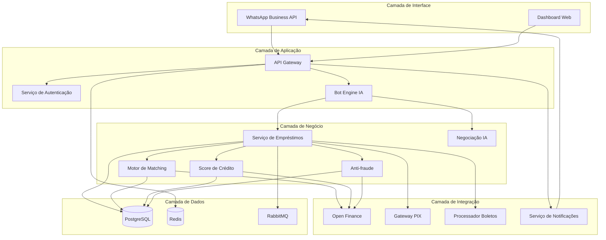
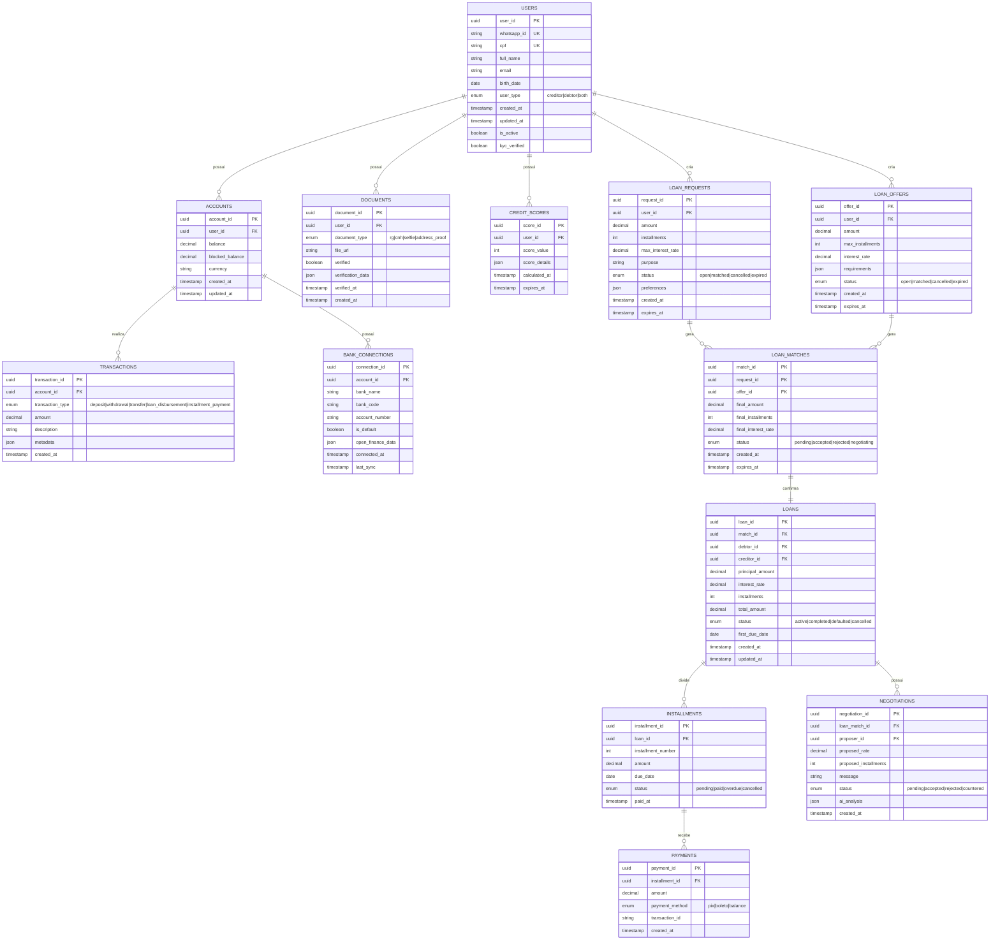
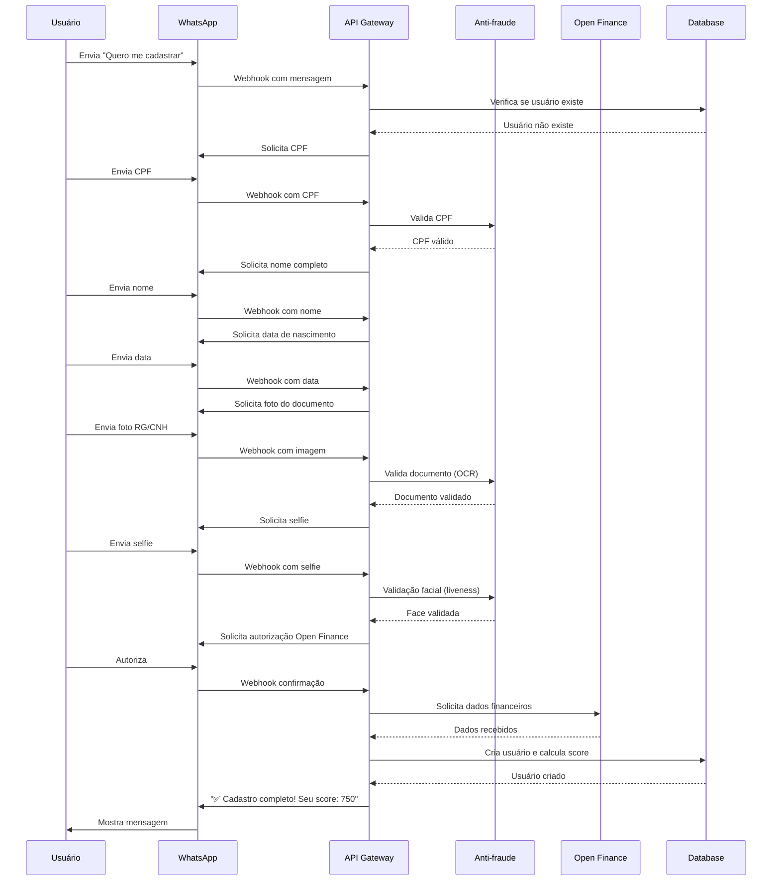
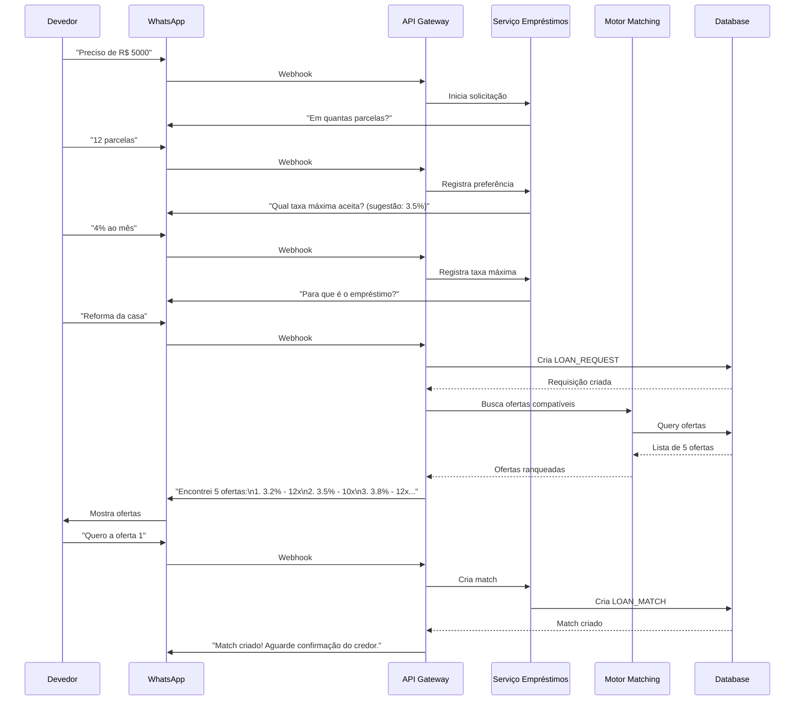
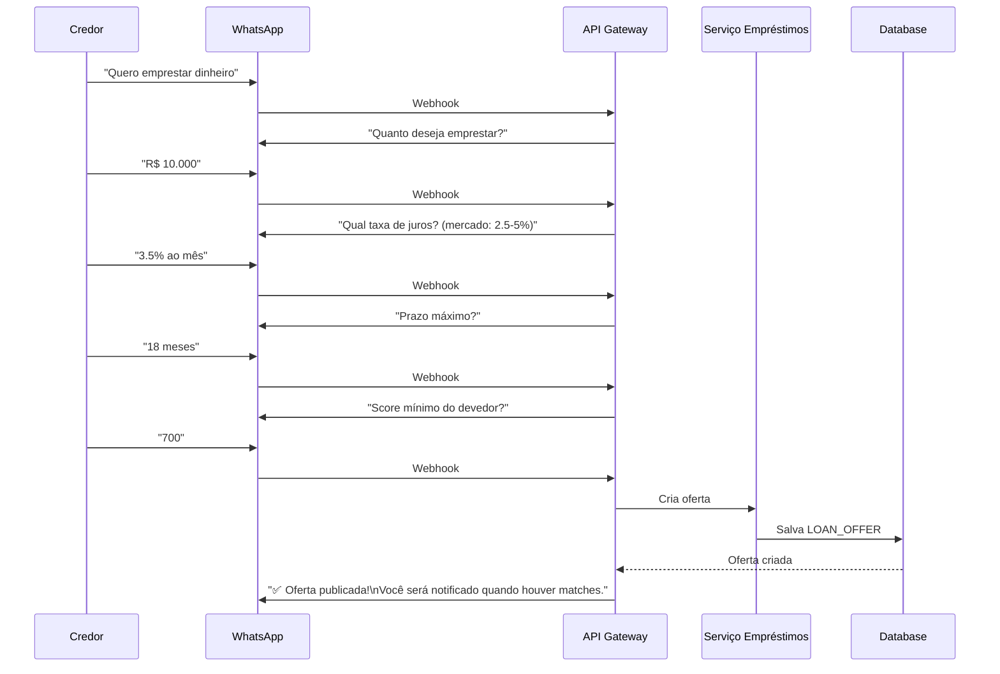
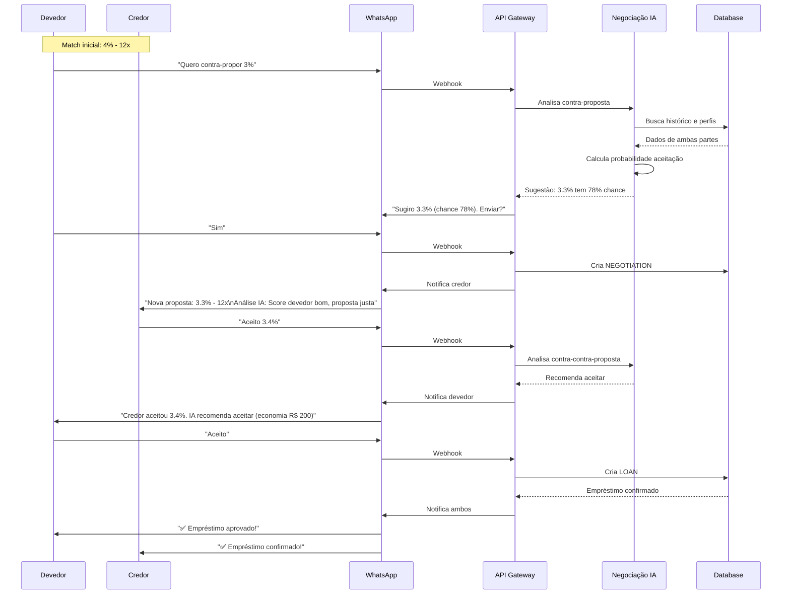
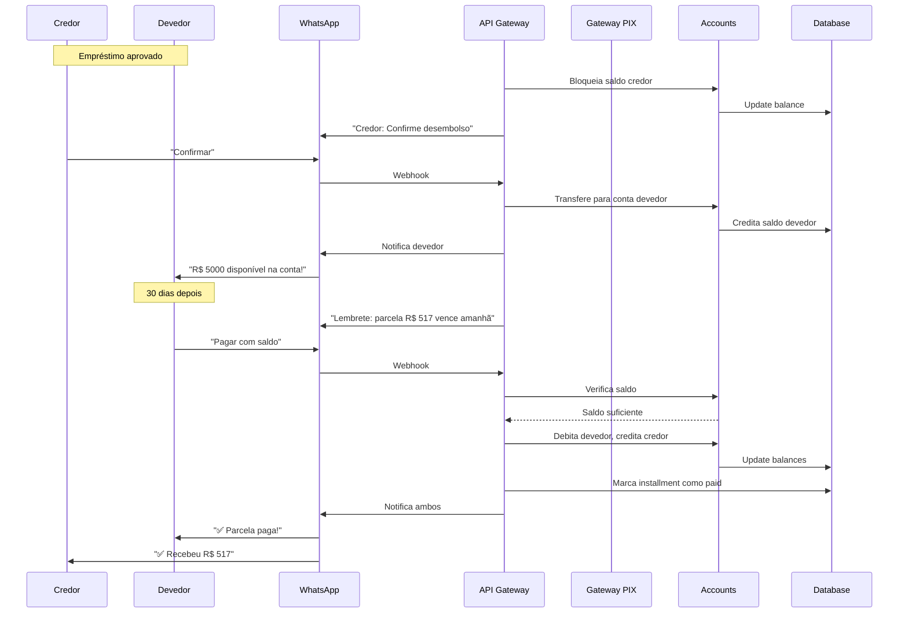
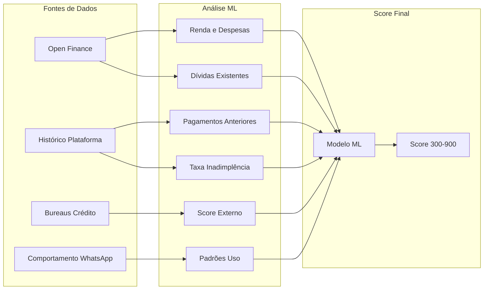
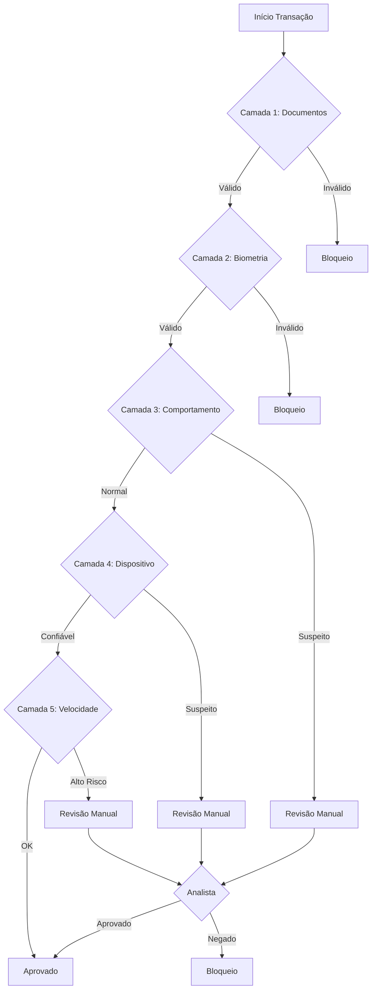
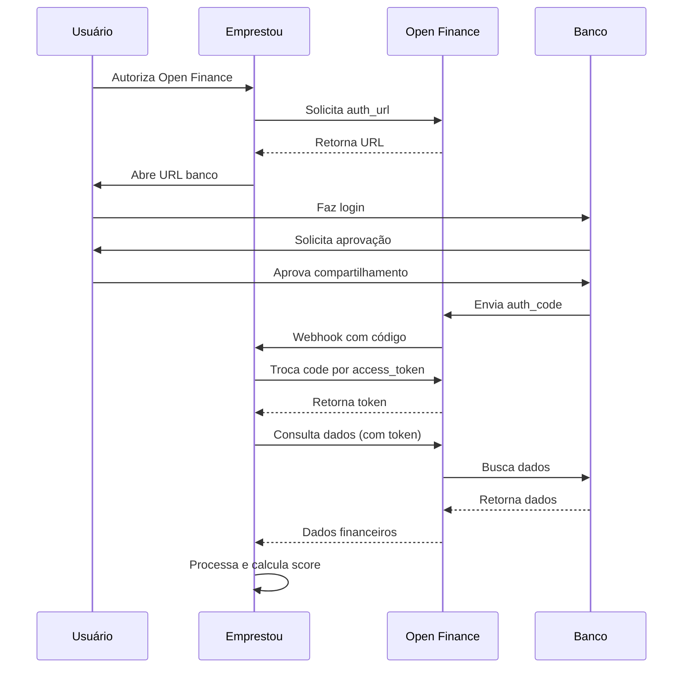

# Projeto Emprestou - Plataforma P2P de Empréstimos via WhatsApp
## Hackathon QI 2024

---

## 1. CONTEXTO

O mercado de crédito brasileiro ainda é marcado por altas taxas de juros bancárias e dificuldade de acesso ao crédito para grande parte da população. Simultaneamente, investidores buscam alternativas de rentabilidade superiores à poupança e renda fixa tradicional. O modelo peer-to-peer (P2P) de empréstimos conecta diretamente credores e devedores, eliminando intermediários bancários e proporcionando taxas mais justas para ambas as partes.

Inspirado no modelo de sucesso da Magie (banco via WhatsApp), o **Emprestou** democratiza o acesso ao crédito através do aplicativo de mensagens mais popular do Brasil, eliminando barreiras tecnológicas e oferecendo uma experiência simples e intuitiva.

### Problema Identificado

- **Para devedores**: Taxas de juros bancárias abusivas (média de 8-15% ao mês)
- **Para credores**: Baixa rentabilidade em investimentos tradicionais
- **Para ambos**: Processos burocráticos e lentos para obtenção/concessão de crédito
- **No mercado**: Falta de transparência e assimetria de informações

### Proposta de Valor

O **Emprestou** oferece:
- Taxas de juros negociáveis entre as partes (2-6% ao mês)
- Processo 100% via WhatsApp - sem necessidade de app adicional
- Marketplace de empréstimos com múltiplas ofertas
- IA para mediação de propostas e contra-propostas
- Open Finance para análise de crédito precisa
- Conta digital integrada para gestão de recursos

---

## 2. OBJETIVO

Desenvolver uma plataforma P2P de empréstimos que conecte credores e devedores através do WhatsApp, garantindo:

1. **Segurança**: Sistema robusto de anti-fraude (KYC) e análise de crédito
2. **Transparência**: Informações claras sobre taxas, prazos e riscos
3. **Praticidade**: Experiência fluida via WhatsApp sem necessidade de apps adicionais
4. **Inovação**: IA para mediação de negociações e scoring dinâmico
5. **Compliance**: Total aderência às regulamentações do Banco Central

---

## 3. ARQUITETURA DO SISTEMA

### 3.1 Visão Geral da Arquitetura



**Explicação da Arquitetura:**

A arquitetura do Emprestou segue um padrão de microsserviços em camadas, garantindo escalabilidade, manutenibilidade e separação de responsabilidades:

**Camada de Interface** - É o ponto de contato com o usuário. O WhatsApp Business API recebe e envia mensagens, enquanto o Dashboard Web permite que administradores gerenciem a plataforma. Ambos se comunicam exclusivamente através do API Gateway.

**Camada de Aplicação** - O API Gateway atua como ponto único de entrada, implementando rate limiting, autenticação e roteamento. O Serviço de Autenticação valida tokens JWT e gerencia sessões. O Bot Engine IA processa linguagem natural dos usuários, interpretando comandos e mantendo contexto conversacional.

**Camada de Negócio** - Contém a lógica core do sistema. O Serviço de Empréstimos orquestra todo o ciclo de vida dos empréstimos. O Motor de Matching conecta credores e devedores usando algoritmos de compatibilidade. O Score de Crédito calcula risco usando ML. O Anti-fraude valida identidades e detecta padrões suspeitos. A Negociação IA medeia contra-propostas entre as partes.

**Camada de Integração** - Conecta-se a sistemas externos. Open Finance busca dados financeiros dos bancos. Gateway PIX processa pagamentos instantâneos. Processador de Boletos gera e paga boletos. Serviço de Notificações envia alertas via WhatsApp.

**Camada de Dados** - PostgreSQL armazena dados relacionais com garantia ACID. Redis cacheia dados frequentes e mantém sessões. RabbitMQ gerencia filas de tarefas assíncronas como cálculo de score e envio de notificações.

Essa arquitetura permite que cada componente escale independentemente. Por exemplo, se houver pico de cadastros, podemos escalar apenas o serviço Anti-fraude sem afetar outros componentes.

### 3.2 Componentes Principais

#### WhatsApp Business API
- Ponto de entrada principal para usuários
- Recebe comandos e envia respostas
- Suporta mensagens interativas (botões, listas)

#### Bot Engine com IA
- Processamento de linguagem natural
- Compreensão de intenções do usuário
- Mediação inteligente de negociações

#### Motor de Matching
- Algoritmo de pareamento entre credores e devedores
- Considera: valor, prazo, taxa, perfil de risco
- Marketplace de propostas públicas

#### Score de Crédito
- Análise via Open Finance
- Machine Learning para predição de inadimplência
- Score dinâmico baseado em comportamento

#### Sistema Anti-fraude
- Validação de documentos (OCR + IA)
- Reconhecimento facial (liveness)
- Análise comportamental
- Integração com bureaus de crédito

---

## 4. ESTRUTURA DE BANCO DE DADOS

### 4.1 Diagrama Entidade-Relacionamento

**Explicação do Modelo de Dados:**

O banco de dados foi modelado para suportar um sistema P2P complexo com múltiplos relacionamentos e fluxos transacionais. A estrutura garante integridade referencial, auditoria completa e performance otimizada.

**Entidades Principais e Relacionamentos:**

**USERS** - Entidade central que representa tanto credores quanto devedores. O campo `user_type` permite que um usuário atue nas duas funções. A validação KYC é rastreada através do campo `kyc_verified`. Cada usuário possui um `whatsapp_id` único que vincula à identidade no WhatsApp.

**ACCOUNTS** - Cada usuário possui uma conta digital onde fica seu saldo disponível. O campo `blocked_balance` armazena valores temporariamente bloqueados durante negociações de empréstimos. Isso evita que um credor comprometa o mesmo dinheiro em múltiplas ofertas.

**DOCUMENTS** - Armazena os documentos do processo KYC (RG, CNH, selfie, comprovante de residência). O campo `verification_data` em JSON contém metadados da validação (score de confiança da IA, campos extraídos por OCR, resultado da biometria).

**CREDIT_SCORES** - Mantém histórico de scores calculados. Cada score tem validade de 30 dias (`expires_at`). O campo `score_details` em JSON armazena os componentes do score (renda verificada, dívidas, histórico de pagamentos) para transparência.

**LOAN_REQUESTS e LOAN_OFFERS** - Representam as duas pontas do marketplace. Requests são criadas por devedores, Offers por credores. Ambas têm status (open, matched, cancelled, expired) e expiram após 30 dias se não houver match.

**LOAN_MATCHES** - Tabela de relacionamento que conecta uma request com uma offer. Aqui ficam os termos negociados (`final_amount`, `final_interest_rate`, `final_installments`). O status `negotiating` indica que há contra-propostas em andamento.

**LOANS** - Representa o empréstimo confirmado. Criado apenas quando ambas as partes aceitam os termos finais. Contém referências ao devedor, credor e match original. O campo `status` rastreia o ciclo de vida (active → completed/defaulted).

**INSTALLMENTS** - Cada empréstimo é dividido em parcelas. Geradas automaticamente na criação do loan. O status muda de `pending` para `paid` quando o pagamento é confirmado. Parcelas com `due_date` passada e status `pending` são marcadas como `overdue`.

**PAYMENTS** - Registra cada pagamento realizado, permitindo múltiplos pagamentos parciais por parcela. O campo `payment_method` rastreia se foi via PIX, boleto ou saldo da conta.

**NEGOTIATIONS** - Armazena o histórico de contra-propostas. O campo `ai_analysis` em JSON contém a recomendação da IA (probabilidade de aceitação, comparação com mercado, sugestões).

**TRANSACTIONS** - Ledger geral de todas as movimentações financeiras na plataforma. Garante rastreabilidade completa e facilita conciliação. Tipos incluem depósitos, saques, transferências, desembolsos e pagamentos de parcelas.

**BANK_CONNECTIONS** - Vincula contas bancárias externas via Open Finance. O campo `open_finance_data` armazena tokens de acesso e dados sincronizados. Permite transferências diretas para bancos tradicionais.

**Estratégias de Performance:**

- Índices compostos em queries frequentes (ex: status + created_at em LOAN_REQUESTS)
- Particionamento de TRANSACTIONS por mês para queries rápidas
- Desnormalização controlada (total_amount pré-calculado em LOANS)
- Views materializadas para dashboard (métricas agregadas atualizadas a cada hora)

**Garantias de Integridade:**

- Foreign keys com CASCADE/RESTRICT apropriados
- Triggers para auditoria automática (log de alterações)
- Constraints de validação (ex: interest_rate entre 0.5% e 15%)
- Transações ACID para operações financeiras críticas



### 4.2 Índices e Otimizações

**Índices Principais:**
- `idx_users_whatsapp_id` em USERS(whatsapp_id)
- `idx_users_cpf` em USERS(cpf)
- `idx_loan_requests_status` em LOAN_REQUESTS(status)
- `idx_loan_offers_status` em LOAN_OFFERS(status)
- `idx_loans_status` em LOANS(status)
- `idx_installments_due_date` em INSTALLMENTS(due_date, status)

**Particionamento:**
- Tabela TRANSACTIONS particionada por mês
- Tabela INSTALLMENTS particionada por trimestre

---

## 5. FLUXOS PRINCIPAIS

### 5.1 Fluxo de Onboarding (KYC)

**Explicação do Fluxo:**

O processo de cadastro (Know Your Customer - KYC) é crítico para a segurança da plataforma e compliance regulatório. O fluxo foi projetado para ser completo, mas ainda assim ágil via WhatsApp.

**Etapa 1 - Início do Cadastro:**
O usuário demonstra interesse enviando mensagem como "Quero me cadastrar" ou "Criar conta". O webhook do WhatsApp captura essa mensagem e envia para a API Gateway. O sistema verifica se o número do WhatsApp já está cadastrado. Se não estiver, inicia o processo conversacional de coleta de dados.

**Etapa 2 - Coleta de Dados Pessoais:**
O bot solicita informações sequencialmente para não sobrecarregar o usuário. Primeiro o CPF, que é validado em tempo real quanto ao formato e existência (consulta à Receita Federal via API). Se o CPF for inválido, o sistema informa e solicita novamente, com limite de 3 tentativas. Em seguida, solicita nome completo (validação de caracteres especiais) e data de nascimento (validação de maioridade - 18+ anos).

**Etapa 3 - Validação Documental:**
O usuário envia foto do documento de identidade (RG ou CNH). O sistema processa a imagem usando OCR (Optical Character Recognition) via AWS Rekognition ou Onfido. Extrai campos como nome, CPF, data de nascimento e compara com os dados informados anteriormente. Valida autenticidade através de marcas d'água, hologramas e padrões esperados. Se houver discrepância ou qualidade ruim, solicita nova foto com orientações específicas.

**Etapa 4 - Biometria Facial:**
Para garantir que a pessoa é realmente quem diz ser, solicita uma selfie. O sistema aplica algoritmos de liveness detection que detectam se é uma foto ao vivo ou apenas uma foto de foto (anti-spoofing). Compara a face da selfie com a foto do documento usando reconhecimento facial. Calcula um score de confiança que deve ser superior a 95% para aprovação. Em caso de falha, permite até 2 novas tentativas com dicas de iluminação e posicionamento.

**Etapa 5 - Open Finance:**
Com a identidade validada, solicita autorização para acessar dados financeiros através do Open Finance. Envia um link que redireciona para o banco do usuário. O usuário faz login no próprio banco e autoriza o compartilhamento de dados específicos (saldo, extratos, renda). O banco redireciona de volta com um código de autorização que é trocado por um token de acesso. Com esse token, o sistema busca histórico financeiro dos últimos 12 meses.

**Etapa 6 - Cálculo de Score:**
Com todos os dados coletados, um processo assíncrono calcula o score de crédito inicial. O modelo de ML considera: renda verificada, relação dívida/renda, histórico de pagamentos no mercado, idade da pessoa, e padrões de gastos. O score vai de 300 a 900 e determina as condições iniciais que o usuário terá acesso.

**Etapa 7 - Finalização:**
O sistema cria o usuário no banco de dados, gera uma conta digital com saldo zero, e envia mensagem de boas-vindas informando o score calculado. O processo todo leva em média 3-5 minutos. O usuário já pode iniciar solicitações ou ofertas de empréstimo imediatamente.

**Tratamento de Erros:**
Se qualquer etapa falhar após 3 tentativas (ex: documento ilegível, face não reconhecida), o cadastro entra em análise manual. Um analista da equipe anti-fraude revisa o caso em até 24h e aprova/reprova manualmente.

**Segurança:**
Todas as imagens são criptografadas antes de armazenar no S3. Dados sensíveis (CPF, documentos) são tokenizados. Logs de auditoria registram cada etapa com timestamp e IP de origem.



### 5.2 Fluxo de Solicitação de Empréstimo (Devedor)

**Explicação do Fluxo:**

Este é o fluxo core para quem precisa de dinheiro emprestado. O processo foi otimizado para ser rápido e conversacional, guiando o usuário passo a passo.

**Etapa 1 - Manifestação de Interesse:**
O devedor inicia o processo enviando mensagens como "Preciso de R$ 5000", "Quero pedir empréstimo" ou simplesmente "Emprestar". O Bot Engine usa NLP (Natural Language Processing) para identificar a intenção. Se o valor já foi mencionado, extrai e registra; caso contrário, solicita explicitamente.

**Etapa 2 - Definição de Prazo:**
O sistema pergunta em quantas parcelas o usuário deseja pagar. Oferece sugestões baseadas no valor solicitado e no score do usuário. Por exemplo, para R$ 5.000 com score 750, sugere entre 6 e 18 parcelas. Calcula e exibe o valor aproximado de cada parcela para diferentes prazos, ajudando na decisão.

**Etapa 3 - Taxa de Juros Máxima:**
Pergunta qual a taxa máxima que o usuário está disposto a pagar. Exibe como referência a taxa média do mercado para seu perfil (baseada no score). Por exemplo, para score 750, sugere 3.5% ao mês. O usuário pode aceitar a sugestão ou definir outro valor. Essa informação é crucial para o matching.

**Etapa 4 - Finalidade do Empréstimo:**
Solicita uma breve descrição do propósito do empréstimo (opcional, mas recomendado). Isso ajuda na transparência e permite que credores escolham apoiar causas específicas. Exemplos: "Reforma da casa", "Compra de moto para trabalhar", "Investir no negócio". Não há validação rígida, mas respostas muito vagas podem reduzir chances de match.

**Etapa 5 - Criação da Solicitação:**
Com todos os dados coletados, o sistema cria um registro LOAN_REQUEST no banco de dados com status "open". Calcula automaticamente uma data de expiração (30 dias). A solicitação entra no marketplace público, visível para todos os credores.

**Etapa 6 - Matching Inteligente:**
O Motor de Matching executa imediatamente uma busca por ofertas compatíveis. Os critérios de compatibilidade incluem: valor disponível na oferta ≥ valor solicitado, prazo da oferta aceita o prazo solicitado, taxa da oferta ≤ taxa máxima aceita pelo devedor, score do devedor ≥ score mínimo exigido pelo credor. O algoritmo ranqueia as ofertas por melhor taxa (menor para o devedor).

**Etapa 7 - Apresentação de Ofertas:**
Se houver matches, o sistema apresenta as top 5 ofertas em formato amigável. Cada oferta mostra: taxa de juros, prazo máximo aceito, valor máximo disponível, score/reputação do credor. Se não houver matches imediatos, informa que a solicitação está publicada e notificará quando surgirem ofertas compatíveis.

**Etapa 8 - Seleção de Oferta:**
O devedor escolhe uma oferta usando o número (1-5) ou enviando "Quero a oferta 1". O sistema valida se a oferta ainda está disponível (outro devedor pode ter escolhido primeiro). Se disponível, cria um LOAN_MATCH com status "pending" e bloqueia o saldo do credor temporariamente (por 48h).

**Etapa 9 - Notificação ao Credor:**
O credor recebe notificação via WhatsApp informando sobre o match. Mostra o perfil do devedor (score, finalidade, histórico na plataforma). O credor tem 48h para aceitar, recusar ou fazer contra-proposta. Após esse prazo, o match expira e o devedor pode escolher outra oferta.

**Experiência Assíncrona:**
O devedor pode sair do WhatsApp e voltar depois. O bot mantém contexto da conversa. Se receber uma nova mensagem não relacionada durante o processo (ex: "Qual meu saldo?"), responde e depois retoma o fluxo de solicitação de onde parou.

**Inteligência na UX:**
O bot detecta dúvidas comuns. Se o usuário perguntar "Quanto vou pagar no total?" durante o processo, calcula e exibe: valor solicitado + juros totais. Se perguntar "Quais documentos preciso?", explica que o KYC já foi feito e não precisa enviar mais nada.



### 5.3 Fluxo de Oferta de Empréstimo (Credor)

**Explicação do Fluxo:**

Este fluxo é para investidores que desejam emprestar dinheiro e obter rentabilidade. O processo coleta preferências do credor para criar uma oferta pública no marketplace.

**Etapa 1 - Manifestação de Interesse:**
O credor inicia enviando mensagens como "Quero emprestar dinheiro", "Investir em empréstimos" ou "Tenho X reais para emprestar". O bot identifica a intenção de ser credor através de NLP. Verifica se o usuário tem saldo suficiente na conta ou se precisará depositar.

**Etapa 2 - Definição do Valor:**
Pergunta quanto o credor deseja disponibilizar para empréstimos. Se o valor exceder o saldo disponível na conta, informa e oferece opções: reduzir o valor da oferta ou fazer um depósito primeiro. Exibe também o valor total já emprestado e disponível para visualizar exposição.

**Etapa 3 - Taxa de Juros Desejada:**
Solicita qual taxa mensal o credor deseja receber. Exibe como referência a taxa média do mercado P2P (geralmente 2.5% a 5% ao mês, dependendo do risco). Informa que taxas muito altas podem reduzir chances de match, enquanto taxas competitivas aumentam velocidade de alocação do capital.

**Etapa 4 - Prazo Máximo:**
Pergunta qual o prazo máximo que aceita emprestar (em meses). Explica que prazos maiores geralmente permitem taxas mais altas, mas aumentam o risco e reduzem liquidez. Sugestões típicas: 6, 12, 18, 24, 36 meses.

**Etapa 5 - Critérios de Risco:**
Solicita o score mínimo do devedor que aceita (300-900). Explica a correlação risco/retorno: scores mais baixos justificam taxas maiores, mas têm mais risco de inadimplência. Oferece também filtros opcionais: finalidade do empréstimo aceita, valor máximo por devedor, diversificação automática (dividir entre vários devedores).

**Etapa 6 - Criação da Oferta:**
Com todos os parâmetros definidos, cria um registro LOAN_OFFER no banco com status "open". Bloqueia o valor especificado no saldo do credor (campo `blocked_balance`), impedindo que seja usado em outras ofertas ou saques. Define expiração de 30 dias (renovável automaticamente).

**Etapa 7 - Publicação no Marketplace:**
A oferta entra no marketplace público, visível para todos os devedores compatíveis. O sistema já executa um matching reverso: busca solicitações abertas que se encaixam nos critérios da oferta. Se encontrar, notifica o credor imediatamente sobre possíveis matches.

**Etapa 8 - Notificações de Match:**
Quando uma solicitação compatível surge (seja nova ou existente), o credor recebe notificação push via WhatsApp. A notificação inclui: valor solicitado, prazo desejado, score do devedor, finalidade declarada. O credor tem 48h para aceitar, recusar ou fazer contra-proposta.

**Gestão de Múltiplas Ofertas:**
Um credor pode ter várias ofertas ativas simultaneamente com critérios diferentes. Por exemplo: Oferta A - R$ 10k a 3% para score 700+, Oferta B - R$ 5k a 5% para score 500-699. O sistema gerencia o saldo bloqueado total e impede overlapping (comprometer mais dinheiro do que possui).

**Inteligência Financeira:**
O bot oferece insights como: "Sua taxa de 3.5% está acima da média do mercado (3.1%). Considere reduzir para aumentar matches" ou "Você tem R$ 5.000 parados há 15 dias. Que tal reduzir a taxa ou relaxar os critérios de score?"

**Transparência de Risco:**
Antes de criar a oferta, o sistema exibe claramente: taxa de inadimplência histórica da plataforma por faixa de score, rentabilidade líquida esperada (descontando inadimplência), comparação com outros investimentos (CDI, Tesouro Direto, CDB).



### 5.4 Fluxo de Negociação com IA

**Explicação do Fluxo:**

Este é um dos diferenciais mais inovadores do Emprestou: a IA atua como mediadora inteligente entre credores e devedores, aumentando as chances de acordo justo para ambas as partes.

**Contexto Inicial:**
Um match foi criado com taxa de 4% ao mês por 12 parcelas. Porém, o devedor acredita que pode conseguir uma taxa melhor baseado em seu bom score. Ao invés de simplesmente recusar e procurar outra oferta, pode fazer uma contra-proposta.

**Etapa 1 - Contra-Proposta do Devedor:**
O devedor envia mensagem "Quero contra-propor 3%". O webhook captura e envia para o serviço de Negociação IA. O sistema registra que é uma nova rodada de negociação vinculada ao match existente.

**Etapa 2 - Análise Preditiva da IA:**
A IA executa múltiplas análises em paralelo: busca no banco o histórico de negociações do credor (quantas vezes aceitou/recusou contra-propostas, qual range de variação aceita), analisa o perfil do devedor (score, histórico, valor solicitado vs renda), consulta dados de mercado (qual taxa média para perfil similar em empréstimos fechados nos últimos 30 dias), calcula elasticidade de preço (sensibilidade do credor a mudanças de taxa).

**Etapa 3 - Cálculo de Probabilidade:**
Com esses dados, um modelo de ML treinado com histórico de negociações prediz a probabilidade de aceitação. Por exemplo: proposta de 3% tem 45% de chance, 3.3% tem 78% de chance, 3.5% tem 90% de chance. O modelo também calcula o impacto financeiro: diferença de custo total para o devedor em cada cenário.

**Etapa 4 - Recomendação Inteligente:**
Baseado na análise, a IA sugere um valor otimizado ao devedor. Não apenas diz "não", mas orienta: "Sugiro 3.3% que tem 78% de chance de aceitação e você economizaria R$ 200 em relação à oferta original". Apresenta também uma tabela comparativa: 3% (economia R$ 300, chance 45%), 3.3% (economia R$ 200, chance 78%), 3.5% (economia R$ 100, chance 90%).

**Etapa 5 - Decisão do Devedor:**
O devedor pode aceitar a recomendação ou insistir na proposta original. Se aceitar, o sistema cria um registro NEGOTIATION no banco com os valores sugeridos e o payload JSON da análise da IA. Se recusar a sugestão, também registra, mas com probabilidade menor.

**Etapa 6 - Notificação ao Credor:**
O credor recebe notificação formatada: "Nova contra-proposta: 3.3% - 12x". Junto vem a análise da IA para o credor: "Score do devedor é 750 (muito bom), taxa proposta está 5% abaixo do mercado mas ainda oferece rentabilidade de 180% do CDI". A IA também avalia se a proposta é justa dadas as condições.

**Etapa 7 - Contra-Contra-Proposta:**
O credor pode aceitar, recusar ou fazer nova contra-proposta. Neste caso, aceita 3.4% (meio termo). A IA analisa novamente para o devedor: compara o 3.4% com a oferta original de 4% e com a tentativa de 3.3%, calcula economia total (R$ 150), avalia se vale a pena continuar negociando ou aceitar.

**Etapa 8 - Recomendação de Aceite:**
A IA recomenda ao devedor aceitar: "Recomendo aceitar. Você economizará R$ 150 e a chance de conseguir algo melhor é baixa (apenas 15% dos credores aceitam taxa inferior a 3.4% para seu perfil)". Apresenta também o risco de recusar: se insistir em 3.3%, o credor pode desistir e perder a oportunidade.

**Etapa 9 - Acordo Final:**
O devedor aceita a proposta de 3.4%. O sistema atualiza o LOAN_MATCH com `final_interest_rate = 3.4` e muda status para "accepted". Cria automaticamente o LOAN definitivo com todos os termos acordados. Notifica ambas as partes sobre o sucesso da negociação.

**Inteligência Emocional:**
A IA também analisa o tom das mensagens. Se detectar frustração ("Isso é um absurdo! Não aceito!"), ajusta a resposta para ser mais empática: "Entendo sua frustração. Vamos buscar uma solução justa para ambos". Se detectar urgência ("Preciso desse dinheiro hoje"), pondera esse fator na recomendação.

**Aprendizado Contínuo:**
Cada negociação alimenta o modelo de ML. Se a IA previu 78% de chance e o credor aceitou, reforça os padrões que levaram a essa previsão. Se previu errado, ajusta os pesos. Com o tempo, as previsões ficam cada vez mais precisas.

**Transparência:**
Tanto credor quanto devedor podem perguntar "Por que a IA sugeriu isso?" e receber explicação: "Baseado em 1.247 negociações similares, credores com perfil parecido aceitam reduções médias de 12% quando o score do devedor é 750+".



### 5.5 Fluxo de Desembolso e Pagamento

**Explicação do Fluxo:**

Este fluxo garante a movimentação segura do dinheiro: do credor para o devedor (desembolso) e do devedor de volta ao credor (pagamentos das parcelas).

**Fase 1 - Bloqueio Preventivo:**
Assim que o empréstimo é aprovado (ambas as partes aceitaram os termos), o sistema imediatamente executa um bloqueio no saldo do credor. O valor sai do campo `balance` e entra em `blocked_balance`. Isso garante que o credor não possa gastar ou emprestar novamente o mesmo dinheiro enquanto o desembolso não for confirmado. A operação é atômica (transação SQL) para evitar race conditions.

**Fase 2 - Confirmação do Desembolso:**
Mesmo com o empréstimo aprovado, existe uma janela de confirmação final. O credor recebe notificação: "Empréstimo aprovado! Confirme o desembolso de R$ 5.000 para [nome do devedor]". Isso dá oportunidade de desistir de última hora (por exemplo, se perceber algo suspeito no perfil). O credor tem 24h para confirmar; após isso, desembolsa automaticamente.

**Fase 3 - Transferência do Valor:**
Ao confirmar, o sistema executa uma transação complexa: debita `blocked_balance` do credor (R$ 5.000), credita `balance` do devedor (R$ 5.000), cria registro em TRANSACTIONS de ambos os lados (tipo "loan_disbursement"), gera INSTALLMENTS (12 parcelas de R$ 517 cada), calcula datas de vencimento (primeira parcela 30 dias após desembolso).

**Fase 4 - Notificação de Disponibilidade:**
O devedor recebe notificação push: "R$ 5.000 disponível na sua conta Emprestou! Você pode transferir para seu banco ou usar direto na plataforma". O saldo aparece instantaneamente na conta virtual dele. Pode sacar via PIX (cobrada taxa de R$ 2) ou deixar para pagar boletos/fazer transferências.

**Fase 5 - Lembretes Automáticos:**
O sistema monitora continuamente as datas de vencimento das parcelas. 7 dias antes do vencimento, envia primeiro lembrete: "Sua parcela de R$ 517 vence em 7 dias". 1 dia antes, envia lembrete urgente: "Lembre-se: parcela vence amanhã. Saldo disponível: R$ XXX". No dia do vencimento, envia notificação final: "Parcela vence hoje! Pague agora para evitar juros de mora".

**Fase 6 - Iniciação do Pagamento:**
O devedor responde "Pagar com saldo". O bot confirma: "Pagar parcela de R$ 517 com saldo da conta? Digite SIM para confirmar". Isso evita pagamentos acidentais. Após confirmação, executa a operação.

**Fase 7 - Validações de Pagamento:**
O sistema verifica múltiplas condições antes de processar: saldo disponível ≥ valor da parcela, parcela ainda não está marcada como paga, não há bloqueio na conta por fraude. Se qualquer validação falhar, informa o motivo e oferece alternativas (pagar via PIX, boleto, fazer depósito).

**Fase 8 - Processamento do Pagamento:**
Se validações OK, executa outra transação atômica: debita `balance` do devedor (R$ 517), credita `balance` do credor (R$ 517), cria PAYMENT vinculado à INSTALLMENT, atualiza status da parcela para "paid", registra timestamp exato do pagamento. Toda operação em uma única transaction SQL.

**Fase 9 - Notificações Bilaterais:**
Ambas as partes são notificadas instantaneamente. Devedor recebe: "Parcela paga com sucesso! Próximo vencimento: [data]. Saldo restante: R$ XXX". Credor recebe: "Você recebeu R$ 517 de [nome do devedor]. Parcela 1/12 do empréstimo #12345. Saldo disponível: R$ YYY".

**Fase 10 - Tratamento de Inadimplência:**
Se a parcela não for paga até a data de vencimento, o status muda automaticamente para "overdue". Inicia-se um fluxo de cobrança: D+1: notificação amigável "Percebemos que sua parcela venceu ontem...", D+3: alerta mais firme + aplicação de juros de mora (2% sobre o valor), D+7: último aviso antes de marcar como inadimplente, D+15: marca como inadimplente, informa bureaus de crédito, suspende conta.

**Alternativas de Pagamento:**
O devedor pode escolher pagar via: saldo da conta Emprestou (instantâneo), PIX para a conta Emprestou (confirma em 10 segundos), boleto gerado (confirma em 1-2 dias úteis), débito automático (configura uma vez, paga todo mês automaticamente).

**Pagamento Antecipado:**
O devedor pode pagar parcelas antecipadamente ou quitar o empréstimo todo. O sistema recalcula os juros proporcionalmente (juros simples sobre período efetivo). Exemplo: quitação após 3 meses de um empréstimo de 12 meses resulta em economia significativa de juros.

**Segurança Transacional:**
Todas as operações financeiras usam isolation level SERIALIZABLE no PostgreSQL. Logs imutáveis são gerados para auditoria. Qualquer falha em qualquer etapa da transação resulta em rollback completo. Reconciliação automática roda a cada hora verificando consistência entre saldos e transações.



---

## 6. SISTEMA DE SCORE DE CRÉDITO

### 6.1 Componentes do Score

O score é calculado com base em múltiplas fontes de dados:

**Explicação do Sistema de Score:**

O score de crédito é o coração da plataforma, determinando quais taxas e limites cada usuário terá acesso. Diferente dos scores tradicionais (Serasa, Boa Vista) que são "caixas-pretas", o Emprestou adota transparência parcial: o usuário sabe os componentes, mas não os pesos exatos (para evitar gaming do sistema).

**Fonte 1 - Open Finance:**
Conecta-se aos bancos do usuário com autorização explícita. Extrai duas categorias principais de dados:

**Renda e Despesas:** Analisa extratos dos últimos 12 meses identificando padrões de entrada (salário, freelance, investimentos) e saída (aluguel, contas, cartão de crédito). Calcula renda média mensal verificada e volatilidade (quanto varia mês a mês). Identifica despesas fixas vs variáveis. Quanto maior e mais estável a renda, melhor o componente.

**Dívidas Existentes:** Consulta empréstimos ativos, limites de cartão de crédito utilizados, financiamentos. Calcula a relação dívida/renda (DTI - Debt-to-Income ratio). Se DTI > 50%, é um red flag forte. O modelo também considera a natureza das dívidas: financiamento imobiliário é visto positivamente (ativo), enquanto cartão de crédito rotativo é negativo.

**Fonte 2 - Histórico na Plataforma:**
À medida que o usuário usa o Emprestou, constrói reputação interna:

**Pagamentos Anteriores:** Se já teve empréstimos na plataforma, analisa histórico: todas as parcelas foram pagas em dia? Houve atrasos (quantos dias, quantas vezes)? Pagou antecipadamente alguma vez (sinal de boa gestão financeira)? Cada empréstimo quitado com sucesso aumenta o score interno.

**Taxa de Inadimplência:** Para credores, calcula percentual de empréstimos que resultaram em calote. Para devedores, marca se já deixou de pagar (impacto severo e duradouro no score). O sistema perdoa atrasos pequenos (1-3 dias) se raros, mas é rigoroso com inadimplência real.

**Fonte 3 - Bureaus de Crédito:**
Integra-se com Serasa, Boa Vista e SPC via APIs:

**Score Externo:** Importa o score tradicional (300-1000 na escala Serasa). Esse score reflete histórico no mercado amplo (não só Emprestou). É um forte preditor de risco, mas não o único. Serve como "segunda opinião" para validar ou questionar o score interno.

**Fonte 4 - Comportamento no WhatsApp:**
Analisa padrões de uso não-financeiros:

**Padrões de Uso:** Frequência de interação com o bot, horários típicos de acesso, tempo de resposta médio. Um usuário que responde instantaneamente sempre pode estar com bot automatizado (fraude). Um que interage regularmente e naturalmente demonstra engajamento legítimo. Tempo de conta (antigamente) também pesa: contas novas têm score inicial mais conservador.

**Modelo de Machine Learning:**
Todos esses componentes alimentam um modelo XGBoost treinado com dados históricos de milhares de empréstimos. O modelo não usa regras simples ("se X então Y"), mas aprende padrões complexos e não-lineares. Por exemplo, pode descobrir que renda alta + dívidas altas é menos arriscado que renda média + dívidas médias, porque sugere capacidade de gestão financeira sofisticada.

**Peso dos Componentes (aproximado):**
- Open Finance (Renda): 25%
- Open Finance (Dívidas): 20%
- Histórico Plataforma: 30%
- Bureaus Externos: 20%
- Comportamento WhatsApp: 5%

**Atualização Dinâmica:**
O score não é estático. Recalcula automaticamente a cada 30 dias ou após eventos significativos: pagamento de parcela, novo empréstimo quitado, atualização de dados do Open Finance (refresh manual ou automático), mudança no score externo dos bureaus.

**Transparência ao Usuário:**
O usuário pode perguntar "Por que meu score é X?" e recebe explicação: "Seu score é 720 (Bom). Principais fatores: ✅ Renda verificada estável, ✅ Última parcela paga em dia, ⚠️ Relação dívida/renda um pouco alta (40%)". Também oferece dicas: "Para melhorar seu score: quite dívidas existentes, mantenha pagamentos em dia, atualize dados do Open Finance".



### 6.2 Faixas de Score

| Score | Classificação | Taxa Sugerida | Limite |
|-------|---------------|---------------|---------|
| 800-900 | Excelente | 2.0-2.5% | Até R$ 50k |
| 700-799 | Muito Bom | 2.5-3.5% | Até R$ 30k |
| 600-699 | Bom | 3.5-4.5% | Até R$ 15k |
| 500-599 | Regular | 4.5-6.0% | Até R$ 8k |
| 300-499 | Ruim | 6.0-8.0% | Até R$ 3k |

### 6.3 Modelo de Machine Learning

**Algoritmo**: XGBoost para classificação de risco

**Features principais**:
- Renda mensal verificada (Open Finance)
- Relação dívida/renda
- Histórico de pagamentos na plataforma
- Score de bureaus externos
- Idade da conta
- Frequência de uso
- Padrões de mensagens

**Atualização**: Score recalculado a cada 30 dias ou após eventos significativos

---

## 7. SISTEMA ANTI-FRAUDE

### 7.1 Camadas de Segurança

**Explicação do Sistema Multi-Camadas Anti-Fraude:**

O sistema anti-fraude funciona como um funil progressivo: cada camada filtra tipos específicos de fraude, tornando cada vez mais difícil para golpistas passarem. Quanto mais camadas são superadas, maior a confiança na legitimidade do usuário.

**Camada 1 - Validação de Documentos:**

Primeira linha de defesa, executada durante o onboarding. O sistema recebe foto do RG ou CNH e realiza análise multicritério:

**OCR Inteligente:** Usa Google Vision API ou Onfido para extrair texto da imagem. Não é simples OCR - identifica campos estruturados (nome, CPF, data de nascimento, RG). Valida formato de cada campo (CPF tem 11 dígitos, data no formato correto). Compara dados extraídos com o que usuário digitou anteriormente - qualquer discrepância é red flag.

**Validação de Autenticidade:** Analisa características do documento físico através da imagem: presença de marca d'água (padrão específico esperado em RGs), hologramas (refletem luz de forma característica), microimpressões (texto minúsculo que impressoras comuns não reproduzem). Detecta sinais de adulteração: bordas recortadas/coladas, fontes inconsistentes, resolução variável em diferentes áreas (indica fotomontagem).

**Cross-Check Externo:** Valida CPF na base da Receita Federal verificando se existe e está regular. Em caso de RG, pode consultar bases estaduais (quando disponíveis via APIs). Para CNH, valida o número de registro no formato padrão do Detran.

**Resultado:** Se qualquer validação falhar, bloqueia imediatamente. Se passar, adiciona score de confiança do documento (0-100%) aos metadados do usuário.

**Camada 2 - Biometria Facial:**

Após documento validado, garante que quem está cadastrando é realmente o dono do documento:

**Liveness Detection:** Técnica crucial para evitar fraude com fotos. Solicita selfie e analisa: micro-movimentos faciais naturais (piscar, respirar), textura de pele real vs foto impressa, profundidade 3D (foto impressa é plana), reflexos de luz na córnea (olho real reflete diferente).

**Comparação Facial:** Algoritmo de reconhecimento facial (AWS Rekognition, Face++) compara a selfie com a foto do documento. Extrai embeddings (representação matemática única do rosto) de ambas as imagens. Calcula similaridade (0-100%). Threshold: acima de 95% aprova, 90-95% análise manual, abaixo de 90% rejeita.

**Resultado:** Se liveness falhar ou similaridade baixa, permite 2 novas tentativas com orientações ("Retire óculos", "Melhore iluminação"). Após 3 falhas, encaminha para análise manual humana.

**Camada 3 - Análise Comportamental:**

Monitora como o usuário interage com o sistema, detectando padrões anormais:

**Velocidade de Digitação:** Humanos digitam com variação natural de velocidade. Bots/scripts digitam uniformemente rápido ou copiam/colam (latência zero). O sistema mede intervalo entre caracteres - se muito uniforme, é suspeito.

**Horários de Acesso:** Analisa quando o usuário tipicamente acessa. Acesso às 3h da manhã pode ser normal para alguns, mas mudança brusca de padrão (sempre acessava de dia, agora só de madrugada) pode indicar conta comprometida.

**Padrões de Linguagem:** O bot aprende como cada usuário escreve (formal/informal, gírias, erros de ortografia consistentes). Mudança drástica no estilo pode indicar que outra pessoa está usando a conta. Mensagens muito formais e robotizadas são suspeitas.

**Geolocalização:** Identifica localização aproximada pelo IP. Se usuário estava em São Paulo e 10 minutos depois está em Manaus, há problema. Permite VPN, mas marca como fator de risco adicional.

**Resultado:** Gera score comportamental (0-100%). Score baixo não bloqueia sozinho, mas soma para decisão final.

**Camada 4 - Device Fingerprinting:**

Identifica unicamente o dispositivo usado, mesmo sem cookies ou logins:

**Identificação do Dispositivo:** Coleta metadados técnicos: modelo do telefone, versão do WhatsApp, resolução de tela, timezone, idioma do sistema. Cria "impressão digital" única do device. Rastreia se o mesmo CPF tenta cadastrar de múltiplos dispositivos suspeitos (indicativo de fraude organizada).

**Histórico de Dispositivos Suspeitos:** Mantém lista negra de devices que foram usados em fraudes confirmadas. Se novo usuário cadastra do mesmo device, bloqueia preventivamente.

**Detecção de Emuladores:** Fraudadores usam emuladores (Android no PC) para escalar golpes. Sistema detecta padrões de emulador: sensores ausentes (giroscópio, GPS), características de hardware inconsistentes.

**Resultado:** Device com histórico limpo passa. Device suspeito ou em lista negra é bloqueado com mensagem genérica (para não ensinar golpistas).

**Camada 5 - Regras de Velocidade:**

Última camada, focada em abuso e fraude em escala:

**Limite de Tentativas:** Máximo 3 tentativas de cadastro por CPF. Previne brute force. Máximo 5 transações por hora por usuário. Previne lavagem de dinheiro. Cooldown de 10 minutos entre empréstimos solicitados. Previne spam.

**Limite de Empréstimos Simultâneos:** Usuário não pode ter mais de 3 empréstimos ativos como devedor. Previne superendividamento e fraude (pegar empréstimos sem intenção de pagar). Credor pode ter ilimitados (desde que tenha saldo).

**Análise de Velocidade de Transações:** Se usuário recebe depósito e imediatamente saca tudo, é padrão de mula (lavagem). Sistema marca para revisão. Múltiplos pequenos depósitos seguidos de saque grande também é red flag (estruturação).

**Resultado:** Violação de limites resulta em bloqueio temporário (24h) ou permanente (casos graves).

**Fluxos de Decisão:**

**Aprovação Automática:** Passa nas 5 camadas com scores altos → aprovado em segundos, pode operar normalmente.

**Revisão Manual:** Passa na maioria, mas algum score intermediário → encaminhado para analista humano revisar em até 24h. Analista tem acesso a todos os dados e contexto, decide aprovar ou negar.

**Bloqueio Automático:** Falha em qualquer camada crítica (documento falso, biometria negativa, device em lista negra) → bloqueio imediato sem possibilidade de recurso automático. Usuário pode entrar em contato com suporte para análise caso ache que foi erro.

**Aprendizado Contínuo:**

Cada fraude detectada (mesmo tardiamente) alimenta o sistema. Se um fraudador passou pelas camadas mas foi descoberto depois, o sistema analisa: quais sinais foram ignorados? Como melhorar a detecção? Atualiza modelos de ML para capturar esse novo padrão.

**Balanceamento Fricção vs Segurança:**

Sistema busca equilibrar: muita fricção → usuários legítimos desistem, pouca fricção → fraudadores passam facilmente. Métricas monitoradas: taxa de aprovação de usuários legítimos (meta: >90%), taxa de detecção de fraude (meta: >95%), tempo médio de onboarding (meta: <5min para usuários legítimos).



### 7.2 Validações Implementadas

1. **Validação de Documentos**
   - OCR com Google Vision API
   - Verificação de autenticidade (marca d'água, holografia)
   - Cross-check com base da Receita Federal
   
2. **Biometria Facial**
   - Liveness detection (anti-foto de foto)
   - Comparação com documento
   - Score de confiança > 95%

3. **Análise Comportamental**
   - Velocidade de digitação
   - Horários de acesso
   - Padrões de linguagem
   - Geolocalização

4. **Device Fingerprinting**
   - Identificação única do dispositivo
   - Histórico de dispositivos suspeitos
   - Detecção de emuladores

5. **Regras de Velocidade**
   - Máximo 3 tentativas de cadastro por CPF
   - Limite de empréstimos simultâneos
   - Cooldown entre transações

---

## 8. INTEGRAÇÕES

### 8.1 Open Finance

**Funcionalidades**:
- Consulta de saldo e extratos
- Verificação de renda
- Análise de padrões de gastos
- Histórico de pagamentos
- Dívidas existentes

**Fluxo de Integração**:

**Explicação da Integração Open Finance:**

O Open Finance (antigo Open Banking) é a regulamentação do Banco Central que permite compartilhamento seguro de dados financeiros entre instituições mediante autorização do cliente. Para o Emprestou, é fundamental para validar renda e calcular score de crédito preciso.

**Etapa 1 - Solicitação de Autorização:**
Após completar KYC básico (documento + biometria), o sistema solicita autorização para acessar dados bancários. Explica claramente ao usuário: quais dados serão acessados (saldo, extratos, renda, dívidas), para que serão usados (calcular score de crédito), quanto tempo a autorização dura (renovação anual), como revogar (a qualquer momento pelo WhatsApp).

**Etapa 2 - Geração de URL de Autenticação:**
O Emprestou envia request para o agregador Open Finance (Pluggy ou Belvo). O agregador retorna uma URL única e temporária (válida por 10 minutos). Essa URL é um endpoint seguro que lista todos os bancos participantes do Open Finance no Brasil (200+).

**Etapa 3 - Redirecionamento ao Banco:**
O sistema envia essa URL ao usuário via WhatsApp. O usuário clica e é redirecionado para interface de seleção de banco. Escolhe seu banco principal (ex: Nubank, Itaú, Bradesco). É redirecionado para o ambiente de login do próprio banco - crucial para segurança, pois o Emprestou nunca vê ou armazena senha bancária.

**Etapa 4 - Login e Aprovação no Banco:**
O usuário faz login usando credenciais do banco (senha, biometria, token). O banco exibe tela listando exatamente quais dados o Emprestou está solicitando: dados cadastrais (nome, CPF já verificado), saldos de contas corrente e poupança, extratos dos últimos 12 meses, informações sobre cartões de crédito, empréstimos e financiamentos ativos. O usuário deve aprovar explicitamente cada categoria.

**Etapa 5 - Geração de Authorization Code:**
Ao aprovar, o banco gera um authorization code (token temporário de uso único). Redireciona de volta para o agregador Open Finance com esse código. Importante: o código não dá acesso aos dados ainda, apenas prova que a autorização foi concedida.

**Etapa 6 - Webhook de Notificação:**
O agregador detecta o redirect e envia webhook para o Emprestou. O payload contém: authorization code, ID da sessão, banco selecionado. Esse webhook permite que o sistema saiba que o usuário completou a autorização sem precisar ficar fazendo polling.

**Etapa 7 - Troca de Code por Access Token:**
O backend do Emprestou recebe o webhook e imediatamente troca o authorization code por um access token permanente. Envia request ao agregador: code, client_id, client_secret (credenciais do Emprestou). Recebe em resposta: access_token (válido por 1 ano), refresh_token (para renovar quando expirar), scope (quais dados foram autorizados).

**Etapa 8 - Consulta de Dados Financeiros:**
Com o access token, o sistema pode finalmente buscar os dados. Faz múltiplas requests ao agregador: GET /accounts → lista contas bancárias, GET /transactions → extratos de 12 meses, GET /credit-cards → cartões e faturas, GET /loans → empréstimos ativos. Cada request passa o access_token no header Authorization: Bearer.

**Etapa 9 - Processamento e Análise:**
O agregador consulta o banco do usuário em tempo real e retorna os dados. O backend do Emprestou processa: identifica padrões de entrada (salário mensal, freelances, investimentos), calcula renda média e volatilidade, mapeia despesas recorrentes (aluguel, contas), soma dívidas ativas, calcula DTI (Debt-to-Income ratio). Tudo armazenado de forma criptografada no campo `open_finance_data` da tabela BANK_CONNECTIONS.

**Etapa 10 - Cálculo de Score:**
Os dados processados alimentam o modelo de ML que calcula o score. Por exemplo: renda verificada de R$ 5.000/mês + DTI de 30% + sem inadimplência = score alto. O resultado é salvo na tabela CREDIT_SCORES com timestamp e validade de 30 dias.

**Notificação ao Usuário:**
Todo esse fluxo técnico leva 20-40 segundos. O usuário recebe mensagem: "Dados bancários sincronizados com sucesso! Seu score de crédito foi calculado: 750 (Muito Bom). Você já pode solicitar empréstimos com taxas a partir de 2.5% ao mês".

**Renovação Automática:**
O access token expira após 1 ano. Próximo da expiração (30 dias antes), o sistema usa o refresh_token para renovar automaticamente sem incomodar o usuário. Se a renovação falhar (usuário revogou acesso no banco), notifica e solicita nova autorização.

**Revogação:**
O usuário pode revogar a qualquer momento enviando "Desconectar banco" no WhatsApp. O sistema: envia request de revoke ao agregador, deleta access/refresh tokens, mantém dados históricos já coletados (compliance), mas não busca dados novos, recalcula score sem componente Open Finance (penaliza score).

**Segurança e Compliance:**
Toda comunicação via HTTPS/TLS 1.3. Tokens armazenados criptografados (AES-256). Logs de acesso rastreiam cada consulta aos dados. Conformidade com LGPD: dados usados apenas para finalidade declarada, usuário pode exportar todos os dados (portabilidade), pode solicitar exclusão completa (direito ao esquecimento).

**Tratamento de Erros:**
Se banco está fora do ar, tenta 3 vezes com backoff exponencial. Se falhar, notifica usuário e agenda retry automático. Se dados estão incompletos (ex: banco não fornece certos campos), usa apenas o disponível e ajusta confiança do score. Se múltiplos bancos estão conectados, prioriza o que tem dados mais completos e recentes.



### 8.2 Gateway PIX

**Funcionalidades**:
- Geração de QR Codes dinâmicos
- Recebimento de pagamentos instantâneos
- Transferências para contas externas
- Webhooks de confirmação

**Provedor**: Mercado Pago / PagSeguro / Stark Bank

### 8.3 Processamento de Boletos

**Funcionalidades**:
- Geração de boletos para parcelas
- Leitura de código de barras
- Pagamento de boletos externos
- Conciliação automática

---

## 9. COMANDOS DO WHATSAPP

### 9.1 Menu Principal

```
🏠 MENU EMPRESTOU

1️⃣ Pedir Empréstimo
2️⃣ Emprestar Dinheiro
3️⃣ Minhas Propostas
4️⃣ Meus Empréstimos
5️⃣ Minha Conta
6️⃣ Transferir
7️⃣ Pagar Boleto
8️⃣ Meu Score
9️⃣ Ajuda

Digite o número ou envie mensagem.
```

### 9.2 Comandos Naturais (NLP)

O bot entende linguagem natural:

- "Preciso de 5 mil reais" → Inicia solicitação
- "Qual meu score?" → Exibe score de crédito
- "Quando vence minha parcela?" → Lista próximos vencimentos
- "Quero emprestar dinheiro" → Inicia criação de oferta
- "Transferir 500 reais para meu banco" → Inicia transferência
- "Pagar boleto" → Inicia pagamento de boleto
- "Ver propostas disponíveis" → Lista marketplace

### 9.3 Botões Interativos

Uso de botões nativos do WhatsApp para melhor UX:
```json
{
  "type": "button",
  "body": {
    "text": "Encontrei 3 ofertas compatíveis. O que deseja fazer?"
  },
  "action": {
    "buttons": [
      {
        "type": "reply",
        "reply": {
          "id": "view_offers",
          "title": "Ver Ofertas"
        }
      },
      {
        "type": "reply",
        "reply": {
          "id": "adjust_search",
          "title": "Ajustar Busca"
        }
      },
      {
        "type": "reply",
        "reply": {
          "id": "cancel",
          "title": "Cancelar"
        }
      }
    ]
  }
}
```

---

## 10. MODELO DE NEGÓCIO

### 10.1 Fontes de Receita

1. **Taxa de Serviço (Principal)**
   - 1.5% sobre cada transação de empréstimo
   - Divida: 1% pago pelo devedor, 0.5% pelo credor
   - Exemplo: Empréstimo de R$ 10.000 = R$ 150 de receita

2. **Taxa de Saque**
   - R$ 2,00 por transferência para banco externo via Open Finance
   - Gratuito para transferências entre usuários Emprestou

3. **Plano Premium (Opcional)**
   - R$ 9,90/mês para credores
   - Benefícios: sem taxa de serviço, prioridade no matching, analytics avançados

4. **Seguro de Inadimplência**
   - 2-4% do valor do empréstimo
   - Opcional para credores
   - Cobertura de 80% em caso de calote

### 10.2 Projeção Financeira (12 meses)

| Mês | Usuários | Empréstimos | Volume (R$) | Receita (R$) |
|-----|----------|-------------|-------------|--------------|
| 1 | 500 | 50 | 250.000 | 3.750 |
| 3 | 2.000 | 300 | 1.500.000 | 22.500 |
| 6 | 8.000 | 1.500 | 7.500.000 | 112.500 |
| 12 | 25.000 | 5.000 | 25.000.000 | 375.000 |

**Custos Mensais (Mês 12)**:
- Infraestrutura AWS: R$ 15.000
- WhatsApp Business API: R$ 8.000
- Open Finance: R$ 12.000
- Equipe (10 pessoas): R$ 120.000
- Marketing: R$ 30.000
- **Total**: R$ 185.000

**Lucro Mensal (Mês 12)**: R$ 190.000
**Break-even**: Mês 8

---

## 11. SEGURANÇA E COMPLIANCE

### 11.1 Segurança Cibernética

**Criptografia**:
- TLS 1.3 para todas as comunicações
- AES-256 para dados em repouso
- Tokenização de dados sensíveis

**Autenticação**:
- MFA obrigatório para transações > R$ 1.000
- Sessões com timeout de 15 minutos
- Biometria para ações críticas

**Auditoria**:
- Logs imutáveis de todas as operações
- Retenção de 7 anos
- Monitoramento 24/7

### 11.2 Compliance Regulatório

**Banco Central**:
- Registro como Instituição de Pagamento (IP)
- Cumprimento da Resolução 4.656
- Relatórios mensais ao BACEN

**LGPD**:
- Consentimento explícito para coleta de dados
- DPO designado
- Direito ao esquecimento implementado

**Prevenção à Lavagem de Dinheiro**:
- KYC robusto
- Monitoramento de transações suspeitas
- Comunicação ao COAF quando necessário

---

## 12. ROADMAP DE DESENVOLVIMENTO

### 12.1 Fase 1: MVP (Sprint Hackathon - 30h)

**Entregáveis**:
- ✅ Bot WhatsApp funcional
- ✅ Cadastro com KYC básico (documento + selfie)
- ✅ Solicitação de empréstimo
- ✅ Oferta de empréstimo
- ✅ Matching manual
- ✅ Score mockado
- ✅ Dashboard administrativo básico

**Stack Técnico**:
- Backend: Python + Flask
- Frontend: React + Tailwind
- Database: PostgreSQL
- WhatsApp: Twilio API
- Deploy: Heroku / Railway

### 12.2 Fase 2: Beta (Pós-Hackathon - 2 meses)

- 🔄 Integração Open Finance
- 🔄 Score de crédito com ML
- 🔄 Gateway PIX real
- 🔄 Negociação com IA
- 🔄 Sistema de parcelas automatizado
- 🔄 App mobile complementar

### 12.3 Fase 3: Produção (3-6 meses)

- 📋 Marketplace público de empréstimos
- 📋 Seguro de inadimplência
- 📋 Pagamento de boletos
- 📋 Investimento automático (robo-advisor)
- 📋 Programa de fidelidade
- 📋 API para parceiros

---

## 13. DIFERENCIAIS COMPETITIVOS

### 13.1 vs. Bancos Tradicionais

| Aspecto | Bancos | Emprestou |
|---------|--------|-----------|
| Taxa Média | 8-15% a.m. | 2-6% a.m. |
| Aprovação | 3-7 dias | Instantânea |
| Canal | Agência/App | WhatsApp |
| Burocracia | Alta | Mínima |
| Transparência | Baixa | Total |

### 13.2 vs. Fintechs de Crédito

| Aspecto | Nubank/C6 | Emprestou |
|---------|-----------|-----------|
| Modelo | B2C | P2P |
| Taxas | 4-9% a.m. | 2-6% a.m. |
| Rentabilidade Investidor | Fixa (~110% CDI) | Negociável (150-300% CDI) |
| Interface | App próprio | WhatsApp |

### 13.3 vs. Plataformas P2P Existentes

| Aspecto | Nexoos/Trustly | Emprestou |
|---------|----------------|-----------|
| Canal | Web/App | WhatsApp |
| Público | Empresas | Pessoas Físicas |
| Ticket Médio | R$ 50k-500k | R$ 3k-30k |
| Aprovação | 48h | Instantânea |
| IA Negociação | ❌ | ✅ |

---

## 14. MÉTRICAS DE SUCESSO

### 14.1 KPIs Técnicos

- **Uptime**: ≥ 99.9%
- **Latência média**: < 1s (resposta WhatsApp)
- **Taxa de erro**: < 0.1%
- **Throughput**: > 500 TPS

### 14.2 KPIs de Produto

- **Taxa de conversão cadastro**: > 60%
- **Taxa de conclusão KYC**: > 80%
- **Match rate**: > 40%
- **Taxa de inadimplência**: < 3%
- **NPS**: > 70

### 14.3 KPIs de Negócio

- **CAC** (Custo de Aquisição): < R$ 50
- **LTV** (Lifetime Value): > R$ 500
- **LTV/CAC**: > 10
- **Churn mensal**: < 5%
- **Ticket médio**: R$ 8.000

---

## 15. TECNOLOGIAS UTILIZADAS

### 15.1 Backend

```yaml
Linguagem: Python 3.11
Framework: Flask 3.0
ORM: SQLAlchemy 2.0
Migrations: Alembic
Task Queue: Celery + RabbitMQ
Cache: Redis 7.0
```

### 15.2 Frontend

```yaml
Framework: React 18
Build: Vite
Styling: Tailwind CSS 3
State: Zustand
Charts: Recharts
Icons: Lucide React
```

### 15.3 Banco de Dados

```yaml
Primary: PostgreSQL 15
Extensions: 
  - pg_trgm (busca texto)
  - uuid-ossp (UUIDs)
  - pg_stat_statements (performance)
```

### 15.4 Infraestrutura

```yaml
Cloud: AWS
Compute: ECS Fargate
Database: RDS PostgreSQL
Cache: ElastiCache Redis
Storage: S3
CDN: CloudFront
Monitoring: CloudWatch + Grafana
```

### 15.5 Integrações

```yaml
WhatsApp: Twilio WhatsApp Business API
Open Finance: Pluggy / Belvo
PIX: Stark Bank API
Anti-fraude: Onfido + AWS Rekognition
ML: AWS SageMaker
```

---

## 16. JUSTIFICATIVA DAS ESCOLHAS TECNOLÓGICAS

### 16.1 Backend: Python + Flask

**Por que Python?**

Python foi escolhido como linguagem principal do backend por razões estratégicas alinhadas aos requisitos do hackathon e do produto:

**1. Velocidade de Desenvolvimento**
Em um hackathon de 30 horas, o tempo é o recurso mais crítico. Python permite prototipagem extremamente rápida com sintaxe limpa e expressiva. Funcionalidades que levariam 100 linhas em Java podem ser implementadas em 20-30 linhas em Python. A filosofia "batteries included" oferece bibliotecas nativas robustas para tarefas comuns (datetime, json, regex, http), eliminando dependências externas desnecessárias.

**2. Ecossistema de Machine Learning**
O Emprestou depende fortemente de ML para score de crédito e negociação inteligente. Python domina completamente este nicho com bibliotecas maduras: scikit-learn para modelos tradicionais, XGBoost/LightGBM para gradient boosting, pandas para manipulação de dados financeiros, numpy para operações numéricas otimizadas. A comunidade de data science é predominantemente Python, facilitando encontrar exemplos, tutoriais e soluções para problemas específicos de credit scoring.

**3. Integrações Facilitadas**
Praticamente todas as APIs que precisamos integrar (Twilio WhatsApp, Open Finance via Pluggy/Belvo, AWS Rekognition, bancos) oferecem SDKs oficiais em Python com documentação exemplar. Isso reduz drasticamente o tempo de integração e bugs. Por exemplo, a integração com Twilio WhatsApp se resume a `pip install twilio` e 5-10 linhas de código para enviar/receber mensagens.

**4. Tipagem Gradual com Type Hints**
Python 3.11 oferece type hints que, combinados com ferramentas como mypy, fornecem verificação estática de tipos sem sacrificar a flexibilidade da linguagem. Isso é crucial em sistemas financeiros onde bugs de tipo podem resultar em perdas monetárias. Exemplo: garantir que `amount: Decimal` não seja confundido com `float` (que tem imprecisões em operações financeiras).

**5. Performance Suficiente**
Embora Python seja interpretado, a performance é adequada para APIs REST típicas (resposta < 100ms). Gargalos reais em aplicações web geralmente estão em I/O (banco de dados, APIs externas), não em CPU. Para operações computacionalmente intensas (cálculo de score), usamos bibliotecas que chamam código C otimizado (NumPy, XGBoost). Para concorrência, async/await nativo resolve problemas de I/O-bound eficientemente.

**Por que Flask especificamente?**

Flask foi escolhido sobre Django e FastAPI por motivos específicos:

**1. Simplicidade e Controle**
Flask é minimalista ("micro-framework") - fornece apenas o essencial (roteamento, requests/responses) e deixa você escolher o resto. Isso é ideal para hackathons onde você quer controle total sem "mágica" do framework. Django seria overkill com seu ORM opinativo, sistema de admin, e convenções rígidas que não precisamos.

**2. Flexibilidade Arquitetural**
Flask permite estruturar a aplicação exatamente como queremos, sem impor padrões MVC/MVT. Nossa arquitetura de microsserviços se beneficia dessa flexibilidade. Podemos organizar por domínio (loans/, users/, transactions/) ao invés de por tipo técnico (models/, views/, controllers/) como Django força.

**3. Extensões Maduras**
Flask tem extensões excelentes para nossas necessidades específicas: Flask-SQLAlchemy (ORM com total controle sobre queries), Flask-Migrate (migrations via Alembic), Flask-JWT-Extended (autenticação JWT), Flask-CORS (necessário para dashboard web), Flask-Limiter (rate limiting essencial para APIs públicas). Cada extensão é opcional e pode ser substituída.

**4. Integração com Celery**
Para tarefas assíncronas (cálculo de score, envio de notificações, processamento de webhooks), precisamos de uma task queue. Flask integra perfeitamente com Celery, permitindo executar tarefas pesadas fora do request/response cycle sem bloquear a API.

**5. Comunidade e Recursos**
Flask existe há 14+ anos com comunidade massiva. Qualquer problema que encontrarmos já foi resolvido no StackOverflow. Essa previsibilidade é valiosa em ambientes de alta pressão como hackathons.

**Alternativas consideradas e por que não foram escolhidas:**

- **FastAPI**: Mais moderno e rápido, mas ecosistema menos maduro. Documentação automática com Swagger é ótima, mas não compensa a falta de exemplos para casos específicos (integração com Celery é mais complicada, menos extensões prontas).

- **Django**: Muito opinativo e "pesado". O ORM Django, embora poderoso, não oferece controle fino sobre queries necessário para otimizações financeiras. Sistema de admin é inútil para nós (temos dashboard React customizado). Estrutura rígida MTV dificulta arquitetura de microsserviços.

- **Node.js (Express)**: JavaScript no backend seria coerente com frontend React, mas ecosistema de ML é fraco. Bibliotecas como TensorFlow.js são limitadas comparadas ao Python. Tipagem com TypeScript adiciona complexidade. Callback hell e event loop podem complicar código síncrono de transações financeiras.

### 16.2 Frontend: React + Tailwind CSS

**Por que React?**

React foi escolhido para o dashboard administrativo por ser a biblioteca UI mais dominante e versátil:

**1. Componentização e Reusabilidade**
React força arquitetura baseada em componentes, perfeito para dashboards complexos. Um componente `<LoanCard>` pode ser reutilizado em múltiplas telas (dashboard, histórico, detalhes). Isso acelera desenvolvimento e garante consistência visual. Em 30 horas, reutilização é crítica.

**2. Ecossistema Massivo**
React tem a maior comunidade frontend do mundo. Qualquer funcionalidade que precisamos (gráficos, tabelas, formulários) já existe como biblioteca pronta: Recharts para gráficos financeiros, React Hook Form para formulários complexos, React Query para gerenciamento de estado servidor, Lucide React para ícones consistentes. Isso elimina reinvenção da roda.

**3. Hooks e Gerenciamento de Estado**
Hooks modernos (useState, useEffect, useContext, custom hooks) simplificam drasticamente código que seria verboso em class components. Para gerenciamento de estado global, optamos por Zustand (mais simples que Redux) que se integra perfeitamente com hooks. Autenticação, dados do usuário, tema podem ser compartilhados entre componentes sem prop drilling.

**4. Performance com Virtual DOM**
Dashboard com milhares de transações precisa ser performático. React otimiza renderizações através do Virtual DOM - apenas elementos que mudaram são atualizados no DOM real. Isso evita layouts lentos e garante UI responsiva mesmo com grandes datasets.

**5. Developer Experience**
React DevTools permitem debug visual da árvore de componentes, inspecionar props/state em tempo real, e identificar gargalos de performance. Hot Module Replacement (HMR) com Vite permite ver mudanças instantaneamente sem recarregar a página, acelerando iteração durante o hackathon.

**Por que Tailwind CSS?**

Tailwind foi escolhido sobre CSS tradicional, SASS, e styled-components por motivos específicos de produtividade:

**1. Velocidade de Desenvolvimento**
Tailwind é utility-first CSS. Ao invés de escrever classes CSS customizadas, você compõe utilitários diretamente no JSX: `<div className="flex items-center justify-between p-4 bg-white rounded-lg shadow">`. Isso elimina context switching entre arquivos HTML/CSS e permite prototipar UIs completas em minutos.

**2. Consistência por Padrão**
Tailwind fornece um design system pré-configurado: escala de espaçamentos (0, 1, 2, 4, 8, 16...), paleta de cores (gray-50 até gray-900), tipografia consistente. Isso garante que o dashboard tenha visual profissional sem precisar de designer. Todos os desenvolvedores usam os mesmos valores, eliminando inconsistências de "margin: 13px" vs "margin: 15px".

**3. Responsividade Trivial**
Tailwind usa prefixos de breakpoint para responsive design: `md:flex-row` (flex-row apenas em telas médias+), `lg:w-1/2` (width 50% apenas em telas grandes). Criar layouts mobile-first que se adaptam a qualquer tela é trivial, essencial para dashboard acessível de tablets/celulares.

**4. Sem CSS Não Utilizado**
Tailwind gera apenas CSS das classes efetivamente usadas no código (via PurgeCSS integrado). Bundle final é tipicamente 10-20KB, muito menor que frameworks como Bootstrap (200KB+). Isso resulta em carregamento mais rápido do dashboard.

**5. Customização e Temas**
Apesar de utility-first, Tailwind é altamente customizável via `tailwind.config.js`. Podemos definir cores da marca Emprestou, fontes específicas, animações customizadas. Para tema claro/escuro (importante para dashboard usado por horas), basta adicionar classe `dark:` nas variants.

**Alternativas consideradas:**

- **Bootstrap**: Componentes prontos são atraentes, mas design genérico ("cara de Bootstrap"). Customização pesada requer sobrescrever CSS, anulando benefício de framework. Classes como `btn btn-primary btn-lg` são verbosas comparadas a `px-4 py-2 bg-blue-500 text-white rounded-lg`.

- **Material-UI**: Componentes React ricos (tables, dialogs, autocomplete) são tentadores, mas bundle size é enorme (300KB+ mesmo com tree-shaking). Performance ruim em dashboards complexos. Estilo Material Design muito opinativo, difícil customizar para marca própria.

- **Styled-components**: CSS-in-JS é poderoso para componentes isolados, mas adiciona runtime overhead. Tailwind é zero-runtime (CSS é extraído em build time). Styled-components também dificulta reuso de estilos entre componentes sem criar abstrações complexas.

### 16.3 Banco de Dados: PostgreSQL

PostgreSQL foi escolhido como banco principal por ser a escolha óbvia para sistemas financeiros:

**1. ACID Compliance e Transações Robustas**
Operações financeiras exigem garantias ACID absolutas. PostgreSQL é conhecido por implementação rigorosa de transações: Atomicidade (tudo ou nada), Consistência (constraints respeitadas), Isolamento (transações concorrentes não interferem), Durabilidade (commits persistidos em disco). Isso é não-negociável para movimentação de dinheiro. Exemplo crítico: transferir R$ 5.000 do credor para devedor deve debitar e creditar atomicamente - se falhar no meio, rollback completo.

**2. Tipos de Dados Financeiros Nativos**
PostgreSQL tem tipo `NUMERIC/DECIMAL` com precisão arbitrária, perfeito para valores monetários. Ao contrário de `FLOAT/DOUBLE` (usados em MySQL até recentemente), NUMERIC não tem erros de arredondamento. Exemplo: `0.1 + 0.2` em float dá `0.30000000000000004`, mas em NUMERIC dá exatamente `0.3`. Para juros compostos calculados mensalmente por anos, esses erros acumulam e resultam em discrepâncias financeiras inaceitáveis.

**3. JSON Nativo e Flexibilidade**
Campos como `verification_data`, `ai_analysis`, `open_finance_data` precisam armazenar estruturas complexas e flexíveis (JSON). PostgreSQL tem tipos `JSON` e `JSONB` (binário, indexável) com operadores poderosos: `jsonb_path_query`, `@>` (contains), `->>` (extract). Podemos fazer queries SQL que filtram por valores dentro de JSON: `WHERE ai_analysis->>'probability' > 0.8`. Isso combina flexibilidade de NoSQL com garantias de SQL relacional.

**4. Performance e Otimização**
PostgreSQL oferece índices sofisticados essenciais para queries financeiras: índices parciais (`WHERE status = 'active'`), índices compostos (`(user_id, created_at DESC)`), índices GIN/GiST para full-text search e JSON, índices de expressão (`LOWER(email)`). Para queries de análise (relatórios de inadimplência, volume por período), temos window functions (`ROW_NUMBER()`, `LAG()`, `LEAD()`) que são muito mais eficientes que múltiplas subqueries.

**5. Particionamento para Escalabilidade**
Tabela TRANSACTIONS crescerá indefinidamente. PostgreSQL suporta particionamento declarativo nativo desde versão 10. Podemos particionar por mês/ano: cada partição é uma tabela física separada, queries automáticamente filtram apenas partições relevantes. Exemplo: buscar transações de dezembro/2024 consulta apenas partição `transactions_2024_12`, não tabela inteira de anos. Isso mantém performance constante mesmo com milhões de registros.

**6. Extensões Poderosas**
PostgreSQL tem ecossistema rico de extensões: `pg_trgm` para fuzzy search em nomes de usuários, `uuid-ossp` para geração de UUIDs (usados como primary keys), `pg_stat_statements` para monitoring de performance de queries, `pgcrypto` para criptografia nativa. Extensão `PostGIS` (embora não usemos agora) estaria disponível se quisermos adicionar features baseadas em geolocalização no futuro.

**7. Compatibilidade com ORMs Python**
SQLAlchemy (ORM Python padrão de facto) tem suporte excelente para PostgreSQL, incluindo tipos avançados (JSONB, ARRAY, UUID), dialects otimizados, e suporte a features específicas do Postgres. Alembic (ferramenta de migrations baseada em SQLAlchemy) gera migrations limpas e seguras para Postgres.

**Alternativas consideradas:**

- **MySQL**: Popular mas menos robusto para finanças. InnoDB (engine transacional) é bom mas não tão rigoroso quanto Postgres. Tipo DECIMAL existe mas JSON é limitado (sem índices JSONB). Community edition não tem particionamento declarativo (apenas 8.0+). Menor foco em compliance ACID em favor de performance.

- **MongoDB**: NoSQL seria flexível para dados semi-estruturados, mas falta de transações ACID entre documentos (até 4.0, e ainda limitado) é inaceitável para sistema financeiro. "Eventually consistent" não serve quando dinheiro está envolvido. Joins são horríveis (aggregation framework complexo). Falta de schema enforcement dificulta garantir integridade.

- **SQLite**: Excelente para desenvolvimento local e testes, mas inadequado para produção com múltiplos escritores. Locking de tabela inteira (não row-level) causa contenção. Não suporta particionamento, replicação, ou clustering. Não escalaria além de alguns usuários simultâneos.

### 16.4 Cache e Filas: Redis + RabbitMQ

**Redis para Cache e Sessões**

Redis é a escolha universal para cache em memória:

**1. Performance Extrema**
Redis armazena dados inteiramente em RAM com acesso O(1) para operações básicas. Latências típicas são sub-milisegundo (< 1ms). Para dados frequentemente acessados (score de crédito de usuário, saldo de conta, taxa de mercado atual), buscar de Redis é 100-1000x mais rápido que PostgreSQL. Isso reduz latência de APIs de 100ms para 10ms.

**2. Estruturas de Dados Nativas**
Ao contrário de Memcached (simples key-value), Redis suporta estruturas complexas: Hashes (armazenar objeto usuário com múltiplos campos), Sorted Sets (ranking de melhores ofertas por taxa), Lists (fila de notificações), Sets (usuários online agora). Essas estruturas eliminam serialização/deserialização complexa e permitem operações atômicas (incrementar contador, adicionar a set).

**3. TTL Automático**
Redis permite definir Time-To-Live em cada chave. Score de crédito vale por 30 dias? `SET score:user123 750 EX 2592000`. Após expiração, chave é automaticamente removida. Isso evita cache stale sem código manual de invalidação.

**4. Pub/Sub para Notificações Real-time**
Redis implementa padrão publish/subscribe. Quando empréstimo é aprovado, publicamos evento: `PUBLISH loan:approved {"loan_id": 123}`. Dashboard web subscrito a esse canal recebe notificação real-time e atualiza UI instantaneamente sem polling. Isso cria experiência de "live updates".

**5. Persistência Opcional**
Embora cache em memória, Redis pode persistir dados em disco (RDB snapshots ou AOF log) para sobreviver reinicializações. Isso é útil para sessões de usuário - não queremos logout forçado se Redis reiniciar.

**RabbitMQ para Task Queues**

RabbitMQ gerencia tarefas assíncronas que não podem rodar durante request HTTP:

**1. Desacoplamento e Resiliência**
Quando usuário completa KYC, cálculo de score pode levar 5-10 segundos (consultar Open Finance, rodar modelo ML, processar dados). Fazer isso síncronamente resulta em timeout HTTP. Solução: API coloca tarefa na fila RabbitMQ e responde imediatamente "processando...". Worker Celery consome tarefa, calcula score, e notifica via webhook. Se worker falhar (crash, deploy), mensagem permanece na fila e é reprocessada.

**2. Garantias de Entrega**
RabbitMQ garante que mensagens não sejam perdidas: persiste em disco antes de ACK, reentrega se consumer falhar antes de ACK, suporta confirmação transacional. Para operações críticas (desembolso de empréstimo, pagamento de parcela), essa garantia é essencial.

**3. Dead Letter Queues**
Se tarefa falhar consistentemente (ex: bug no código, dados inválidos), RabbitMQ move para Dead Letter Queue após X tentativas. Isso evita loop infinito de reprocessamento e permite investigação manual de falhas.

**4. Priorização e Routing**
RabbitMQ suporta exchanges que roteiam mensagens por padrões. Podemos ter filas separadas: `queue.kyc.high` (verificação urgente), `queue.kyc.normal`, `queue.notifications`. Isso permite priorizar tarefas críticas e escalar workers independentemente por tipo de tarefa.

**5. Integração Nativa com Celery**
Celery (biblioteca Python de distributed task queue) usa RabbitMQ como broker padrão com integração zero-friction. Definir tarefa é trivial:
```python
@celery.task
def calculate_credit_score(user_id):
    # código
```
Chamar é assíncrono: `calculate_credit_score.delay(user_id)` envia para fila instantaneamente.

**Alternativas:**

- **Celery + Redis**: Celery pode usar Redis como broker, eliminando RabbitMQ. Vantagem: menos infraestrutura. Desvantagem: Redis não foi projetado como message queue, garantias são mais fracas. Para sistema financeiro, preferimos garantias robustas de RabbitMQ.

- **AWS SQS**: Managed queue da AWS seria opção válida (zero manutenção), mas temos lock-in vendor e latências maiores (requisições HTTP para AWS). RabbitMQ local tem latências sub-milisegundo.

### 16.5 Infraestrutura: AWS

AWS foi escolhida como cloud provider pelos seguintes motivos:

**1. Ecossistema Completo e Maduro**
AWS oferece todos os serviços que precisamos em uma plataforma integrada: ECS Fargate (containers serverless para APIs), RDS (PostgreSQL gerenciado), ElastiCache (Redis gerenciado), S3 (armazenamento de documentos KYC), CloudFront (CDN para dashboard), SageMaker (training de modelos ML), Rekognition (biometria facial). Integração entre serviços é nativa via IAM roles - não precisamos gerenciar credenciais entre sistemas.

**2. Conformidade e Certificações**
Sistema financeiro requer conformidade rigorosa: PCI-DSS (dados de pagamento), SOC 2 (controles de segurança), ISO 27001 (gestão de segurança da informação). AWS é certificada em todos esses padrões. Usar infraestrutura compliant reduz drasticamente nosso escopo de auditoria - não precisamos provar segurança física de data centers, por exemplo.

**3. Segurança Multi-Camadas**
AWS fornece ferramentas de segurança que seriam complexas/caras de implementar: VPC (rede isolada), Security Groups (firewalls granulares), KMS (gerenciamento de chaves de criptografia), CloudTrail (audit logs imutáveis), GuardDuty (detecção de ameaças com ML), WAF (web application firewall). Para sistema que movimenta dinheiro, essas camadas de segurança são essenciais.

**4. Escalabilidade Automática**
ECS Fargate escala containers automaticamente baseado em CPU/memória. Se houver pico de cadastros durante campanha de marketing, Fargate adiciona instâncias automaticamente. RDS oferece read replicas para escalar leituras. ElastiCache suporta sharding para escalar cache horizontalmente. Isso garante que sistema não caia sob carga sem intervenção manual.

**5. Custo-Efetivo para Startup**
AWS oferece free tier generoso: 750h/mês de t2.micro (suficiente para MVP), 20GB de RDS, 750h de ElastiCache. Estimamos custo inicial < R$ 500/mês. Modelo pay-as-you-go evita custos fixos altos de servidores dedicados. À medida que crescemos, podemos usar Reserved Instances (desconto 30-50%) ou Savings Plans.

**6. Managed Services Reduzem Overhead Operacional**
Em hackathon/startup, foco deve ser em produto, não infraestrutura. RDS gerencia backups automáticos, patches de segurança, failover. ElastiCache gerencia replicação e failover de Redis. ECS gerencia orquestração de containers. Isso libera time de engenharia para features de negócio ao invés de administração de sistemas.

**Serviços AWS Específicos Utilizados:**

**ECS Fargate (Compute)**
- Serverless containers: não gerenciamos VMs
- Integração nativa com Application Load Balancer
- Deployment zero-downtime com rolling updates
- Logs centralizados em CloudWatch
- Auto-scaling baseado em métricas customizadas

**RDS PostgreSQL (Database)**
- Multi-AZ para alta disponibilidade (failover automático)
- Backups automáticos com point-in-time recovery
- Encryption at rest (KMS) e in transit (SSL/TLS)
- Performance Insights para debugging de queries lentas
- Automated patches e upgrades de versão

**ElastiCache Redis (Cache)**
- Cluster mode para sharding automático
- Replication para read scaling
- Snapshots automáticos para backup
- Encryption in transit e at rest
- VPC isolation para segurança

**S3 (Storage)**
- Armazenamento de documentos KYC (RG, CNH, selfies)
- Lifecycle policies: mover para Glacier após 1 ano (compliance + custo)
- Versioning: manter histórico de documentos
- Encryption server-side automática (SSE-S3)
- Pre-signed URLs para download seguro sem expor buckets

**CloudFront (CDN)**
- Distribuição global do dashboard React
- Cache de assets estáticos (JS, CSS, imagens)
- SSL/TLS terminado no edge (latência menor)
- Proteção contra DDoS (AWS Shield)
- Invalidação rápida para deploys

**SageMaker (Machine Learning)**
- Training de modelos de credit scoring em infraestrutura escalável
- Hyperparameter tuning automático
- Hosted endpoints para inference (API de score)
- Model registry para versionamento de modelos
- Monitoring de drift de modelo em produção

**Rekognition (Computer Vision)**
- Detecção de faces em documentos e selfies
- Comparação facial (matching score)
- Liveness detection (detecta foto de foto)
- OCR de documentos (extração de texto)
- Retorna confidence scores para decisões graduais

**Alternativas Consideradas:**

- **Google Cloud Platform**: Competitivo em ML (GCP lidera em TensorFlow), mas ecossistema financeiro menos maduro. Menor disponibilidade de certificações de compliance no Brasil. Documentação menos abrangente.

- **Azure**: Forte em enterprise e integração com Microsoft stack, mas desnecessário para nós (não usamos .NET, Windows, Active Directory). Interface mais complexa que AWS Console.

- **Heroku**: PaaS simples, perfeito para MVP rapidíssimo. Limitação: custo aumenta dramaticamente com escala. Sem controle fino de infraestrutura (não podemos configurar VPC customizada, por exemplo). Vendor lock-in pesado.

- **Digital Ocean**: Mais barato que AWS para infraestrutura básica (Droplets, Managed Databases). Limitação: falta serviços especializados (Rekognition, SageMaker). Teríamos que integrar providers diferentes (ex: Onfido para KYC), aumentando complexidade.

### 16.6 Integrações de Terceiros

**Twilio WhatsApp Business API**

Escolhido sobre WhatsApp Business API direto do Meta:

**1. Abstração e Simplificação**
API oficial do Meta é complexa com múltiplos webhooks, configurações de Business Manager, e approval process longo. Twilio abstrai isso fornecendo interface unificada. Setup leva minutos vs dias/semanas com Meta direta.

**2. SDK Python Excepcional**
`pip install twilio` + 10 linhas de código para enviar/receber mensagens. Documentação com exemplos práticos para todos os casos de uso (mensagens de texto, imagens, botões interativos, listas). Suporte oficial e community troubleshooting robusto.

**3. Infraestrutura de Webhooks**
Twilio gerencia toda infraestrutura de webhooks: retries automáticos se nosso servidor estiver down, deduplicação de mensagens duplicadas, logs de entrega, métricas de latência. Fazer isso manualmente seria complexo.

**4. Compliance e Certificações**
Twilio é certificada para processamento de dados sensíveis (SOC 2, ISO 27001). Mensagens WhatsApp transitam por infraestrutura Twilio com encryption end-to-end mantida. Isso simplifica nosso compliance.

**5. Preço Transparente**
Modelo de preço claro: R$ 0,03-0,10 por mensagem dependendo do país. Previsível para orçamento. Meta direta tem preço similar mas com aprovação manual de quotas mensais (burocrático).

**Pluggy/Belvo (Open Finance Aggregator)**

Precisamos de agregador ao invés de integrar com cada banco individualmente:

**1. Abstração de Complexidade**
Brasil tem 200+ instituições participantes do Open Finance, cada uma com API diferente, fluxos de auth diferentes, e idiosincrasias. Pluggy/Belvo abstraem isso em API única: um endpoint para conectar Itaú, Nubank, Bradesco, C6, etc. Sem agregador, precisaríamos integrar 200+ APIs manualmente.

**2. Manutenção e Atualizações**
Bancos mudam suas APIs frequentemente (novos endpoints, campos deprecados, mudanças de auth). Pluggy monitora e atualiza integrações automaticamente. Se Nubank mudar API amanhã, não precisamos fazer nada - Pluggy ajusta por baixo.

**3. Normalização de Dados**
Cada banco retorna dados em formatos diferentes (JSONs com estruturas variadas, nomenclaturas diferentes). Pluggy normaliza tudo: campo `balance` sempre no mesmo lugar, `transactions` sempre no mesmo formato. Isso simplifica drasticamente nosso código de processamento.

**4. Reliability e Fallbacks**
Se banco específico está fora do ar ou com rate limit, Pluggy implementa retries inteligentes, circuit breakers, e fallbacks. Eles monitoram uptime de cada banco e ajustam estratégias automaticamente.

**5. Dashboard e Monitoring**
Pluggy oferece dashboard onde vemos métricas: quantas conexões ativas, taxa de sucesso por banco, latências. Logs de cada request para debugging. Webhooks configuráveis para eventos (conexão expirou, novo statement disponível).

**Stark Bank (PIX Gateway)**

Escolhido sobre Mercado Pago, PagSeguro para PIX:

**1. API Developer-First**
Stark Bank foi construído para desenvolvedores. API é RESTful limpa, documentação interativa (OpenAPI), SDKs idiomáticos para Python. Criar transação PIX é literalmente 5 linhas de código. Webhooks são configuráveis via API (não precisa acessar dashboard).

**2. Preço Competitivo**
Stark cobra R$ 0,99 por transação PIX (entre os mais baratos do mercado). Mercado Pago cobra 1,99%, PagSeguro 3,99%. Para plataforma P2P com alto volume, diferença de custo é significativa.

**3. Features Avançadas de PIX**
Stark implementa toda especificação PIX do BACEN: QR Code dinâmico com valor variável, PIX agendado, PIX com devolução, split payments (dividir recebimento entre múltiplas contas). Isso dá flexibilidade para features futuras.

**4. Conciliação Automática**
Stark envia webhook imediatamente quando PIX é recebido/enviado. Payload inclui todas informações para conciliação (valor, timestamp, identificador único). Podemos automaticamente marcar parcelas como pagas sem intervenção manual.

**5. Sandbox Completo**
Stark oferece ambiente de sandbox idêntico à produção. Podemos testar fluxos completos (gerar QR code, simular pagamento, receber webhook) sem movimentar dinheiro real. Crítico para desenvolvimento e testes automatizados.

**Onfido + AWS Rekognition (Biometria e OCR)**

Combinação de dois serviços para KYC robusto:

**Onfido:**
- Especializado em identity verification para fintechs
- OCR treinado especificamente em documentos brasileiros (RG, CNH)
- Liveness detection de última geração (detecta máscaras 3D, deepfakes)
- Base de documentos fraudulentos conhecidos
- Compliance com regulamentações KYC do BACEN

**AWS Rekognition:**
- Backup/validação adicional para comparação facial
- Integração nativa com nossa infraestrutura AWS
- Confidence scores granulares para decisões graduais
- Detecção de faces múltiplas (alerta se documento tem várias pessoas)
- Análise de qualidade de imagem (blur detection, iluminação)

Usar ambos em paralelo aumenta accuracy e reduz falsos negativos/positivos.

### 16.7 Considerações de Escalabilidade

A stack escolhida suporta crescimento de 100 usuários para 100.000 usuários sem reescrita:

**Horizontal Scaling:**
- **Backend**: ECS Fargate adiciona containers sob demanda
- **Database**: RDS Read Replicas para leituras, eventual sharding por região
- **Cache**: ElastiCache cluster mode com sharding automático
- **Queue**: RabbitMQ clustering com múltiplos brokers

**Vertical Scaling:**
- **Database**: RDS permite upgrade de instance type sem downtime
- **Redis**: ElastiCache permite resize de nodes
- Todos serviços managed permitem escalar recursos com cliques

**Monitoring e Observability:**
- CloudWatch para métricas de infraestrutura
- APM (Application Performance Monitoring) com Datadog/New Relic
- Error tracking com Sentry
- Logs centralizados em ELK stack (Elasticsearch, Logstash, Kibana)

---

## 17. ESTRUTURA DE ARQUIVOS

```
emprestou/
├── backend/
│   ├── app/
│   │   ├── __init__.py
│   │   ├── models/
│   │   │   ├── user.py
│   │   │   ├── account.py
│   │   │   ├── loan.py
│   │   │   ├── transaction.py
│   │   │   └── document.py
│   │   ├── services/
│   │   │   ├── whatsapp_bot.py
│   │   │   ├── kyc_service.py
│   │   │   ├── score_service.py
│   │   │   ├── matching_service.py
│   │   │   ├── loan_service.py
│   │   │   ├── payment_service.py
│   │   │   └── ai_negotiation.py
│   │   ├── integrations/
│   │   │   ├── open_finance.py
│   │   │   ├── pix_gateway.py
│   │   │   ├── boleto_processor.py
│   │   │   └── fraud_detection.py
│   │   ├── api/
│   │   │   ├── routes/
│   │   │   │   ├── auth.py
│   │   │   │   ├── users.py
│   │   │   │   ├── loans.py
│   │   │   │   ├── transactions.py
│   │   │   │   └── webhooks.py
│   │   │   └── middleware/
│   │   │       ├── auth_middleware.py
│   │   │       └── rate_limiter.py
│   │   ├── ml/
│   │   │   ├── credit_score_model.py
│   │   │   ├── fraud_model.py
│   │   │   └── training_pipeline.py
│   │   └── utils/
│   │       ├── validators.py
│   │       ├── formatters.py
│   │       └── security.py
│   ├── migrations/
│   ├── tests/
│   ├── requirements.txt
│   └── config.py
├── frontend/
│   ├── src/
│   │   ├── components/
│   │   │   ├── dashboard/
│   │   │   ├── loans/
│   │   │   ├── users/
│   │   │   └── common/
│   │   ├── pages/
│   │   ├── hooks/
│   │   ├── services/
│   │   ├── store/
│   │   └── utils/
│   ├── public/
│   ├── package.json
│   └── vite.config.js
├── docs/
│   ├── API.md
│   ├── ARCHITECTURE.md
│   ├── DEPLOYMENT.md
│   └── USER_GUIDE.md
├── docker-compose.yml
├── .env.example
└── README.md
```

---

## 17. PRÓXIMOS PASSOS (PÓS-PRÉ-PROJETO)

1. **Validação com Mentores QI** (26 e 29/09)
   - Revisão da arquitetura
   - Validação do modelo de negócio
   - Ajustes no escopo

2. **Preparação para Sprint** (30/09 - 03/10)
   - Setup do ambiente de desenvolvimento
   - Criação dos repositórios
   - Definição de tasks no backlog

3. **Imersão no Escritório QI** (04-05/10)
   - Desenvolvimento intensivo 30h
   - Mentoria com devs QI
   - Testes e ajustes
   - Preparação da apresentação

4. **Apresentação Final** (05/10 - 14h)
   - Demo ao vivo
   - Explicação técnica
   - Defesa do modelo de negócio

---

## 18. EQUIPE E RESPONSABILIDADES

### Time Proposto (Trio)

**Desenvolvedor Full-Stack** (Você)
- Arquitetura geral
- Backend (API + Integrações)
- Coordenação técnica

**Desenvolvedor Frontend**
- Dashboard administrativo
- Componentes React
- UX/UI

**Data Scientist / ML Engineer**
- Modelo de score de crédito
- Sistema anti-fraude
- IA de negociação

### Divisão de Trabalho (Sprint 30h)

| Período | Dev Full-Stack | Dev Frontend | Data Scientist |
|---------|----------------|--------------|----------------|
| Sáb 8-12h | Setup + API Base | Setup + Layout | Setup ML Pipeline |
| Sáb 13-18h | WhatsApp Bot | Dashboard | Score Model |
| Sáb 19-22h | Matching Service | Telas Loans | Fraud Detection |
| Dom 8-12h | Integrações | Telas Users | IA Negociação |
| Dom 13-14h | Testes + Deploy | Ajustes UI | Testes ML |

---

## CONTATO E APRESENTAÇÃO

**Nome do Projeto**: Emprestou
**Tagline**: "Crédito justo, direto no seu WhatsApp"
**Categoria**: P2P Lending + FinTech + Conversational AI

**Diferenciais para a Banca**:
1. ✅ Cumpre TODOS os requisitos (Anti-fraude, Score, P2P)
2. 🚀 Inovação: IA para negociação de taxas
3. 💬 Canal único: 100% via WhatsApp
4. 🏦 Open Finance para score preciso
5. 💰 Modelo de negócio escalável e rentável
6. 🔒 Segurança em múltiplas camadas
7. 📊 Tecnologia justificada e moderna

---

**Documentação criada para o Hackathon QI 2024**
**Última atualização**: Setembro 2024
**Versão**: 1.0